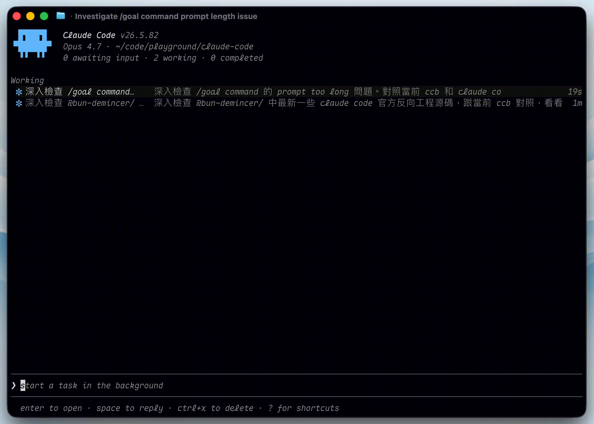

# Claude Code Best

[English](./README.md) | [简体中文](./README.zh-CN.md)

[](https://github.com/Icarus603/claude-code/releases)
[](https://github.com/Icarus603/claude-code/actions/workflows/ci.yml)
[](https://github.com/Icarus603/claude-code/commits/main)
[](https://github.com/Icarus603/claude-code/stargazers)
[](https://github.com/Icarus603/claude-code/releases/latest)
[](https://bun.sh)
[](https://github.com/Icarus603/claude-code)

[](#install)
[](https://claude.ai/upgrade)
[](https://console.anthropic.com)
[](https://docs.anthropic.com/en/api)
[](https://platform.openai.com/docs/api-reference/chat)
[](https://openai.com/codex)
[](https://ai.google.dev)

終端編程智慧體。單一 binary `ccb`。同一個 agent loop 對接 Anthropic（OAuth 或 API key）、Anthropic 相容端點、ChatGPT Codex（OAuth）、OpenAI 相容端點（Ollama、DeepSeek、vLLM……）、Gemini。支援 macOS、Linux、Windows。

Claude Code 的個人維護公開衍生版；baseline 由 v2.1.88 sourcemap 重建（2026-03-31），相容性已檢視至 stable 2.1.197。詳見 [`ATTRIBUTION.md`](./ATTRIBUTION.md) 與 [`上游相容性基準`](./docs/upstream-compatibility.md)。與 Anthropic 無關。

---

## 安裝

**macOS / Linux**（Windows 的 Git Bash / WSL 也適用）：

```bash
curl -fsSL https://raw.githubusercontent.com/Icarus603/claude-code/main/install.sh | bash
```

**Windows**（PowerShell）：

```powershell
irm https://raw.githubusercontent.com/Icarus603/claude-code/main/install.ps1 | iex
```

不需要 Node、Bun 或任何套件管理器。每次啟動自動檢查更新。

---

## 快速上手

開啟終端機 — **macOS** 按 `⌘ Space`，輸入 `Terminal`，按 Enter。**Linux** 按 `Ctrl Alt T`。**Windows** 從開始功能表開啟 **PowerShell**。

接著執行：

```bash
ccb
```

這會進入互動式 REPL。用中文或英文輸入任務，按 `Enter` 送出：

```
> 把 auth 模組重構成 async/await
> 解釋這個專案在做什麼
> 幫 src/utils/parser.ts 寫測試
```

**一次性模式**（不進 REPL，直接輸出結果）：

```bash
ccb -p "package.json 是在做什麼？"
```

**繼續上一次的對話：**

```bash
ccb --continue
```

**REPL 內快捷鍵：**

| 按鍵 | 動作 |
|------|------|
| `Enter` | 送出訊息 |
| `Shift+Enter` | 換行 |
| `Escape` | 中止目前回應 |
| `/help` | 顯示所有指令 |
| `Ctrl+C` | 離開 |

> 不支援 Windows ARM64，請在 x64 模擬下執行，或改走 WSL。

---

## 10 分鐘上手 ccb — `/powerup`

新手？在 REPL 中輸入：

```
/powerup
```

10 個短小的互動課程，帶你逐一體驗 ccb 真正值得用的功能 — `@` 檔案提及、權限模式、`/rewind` 與 Esc-Esc 還原、背景 session、CLAUDE.md、MCP、Skills 與 hooks、`/fork` 平行分支、模型調節、多 provider 切換。打開一條、試一試、標記完成。首頁 banner 會持續顯示進度直到 10 條全部解鎖。

---

## 記憶整理 — `/dream`

<p align="center">
  
</p>

ccb 在 `~/.claude/projects/<project>/memory/` 維護一套持久化、以檔案為基礎的記憶 — 一個 `MEMORY.md` 索引加上分型主題檔（`user`、`feedback`、`project`、`reference`）。它在工作過程中即時寫入這些檔案，讓新 session 能快速進入狀況。經過多次 session 之後，這些檔案會漂移：條目過時、彼此重複、或與當前程式碼矛盾。`/dream` 就是負責清理它們的反思流程。

在 REPL 中輸入：

```
/dream
```

它會**立刻在前景執行，擁有完整工具權限**，全程讓你看著。模型會對記憶目錄做四階段整理：

1. **定位（Orient）** — `ls` 記憶目錄、讀 `MEMORY.md`、瀏覽主題檔與最近的 session 日誌，以便改進而非重複建立。
2. **採集（Gather）** — 從 session 日誌與 transcript（窄關鍵詞 grep，從不全文讀取）收集新信號，並標出與程式碼漂移的記憶。
3. **整合（Consolidate）** — 把新信號併入既有檔案、把相對日期轉成絕對日期、刪除被推翻的事實。
4. **修剪與索引（Prune & index）** — 讓 `MEMORY.md` 保持索引形態（每條一行、200 行 / ~25 KB 以內）、移除被取代的指針、與 `CLAUDE.md` 對帳。

完成後你會拿到一份簡短摘要，說明整理、更新或修剪了什麼。

### 三種模式

| 命令 | 作用 |
|------|------|
| `/dream` | 立刻整理 — 前景、完整工具、你在旁邊看。可在後面接文字當額外脈絡（例如 `/dream 聚焦在 auth 重構`）。 |
| `/dream nightly` | 排程每晚自動整理。安裝一個 `durable`、`recurring` 的 cron，在本地時間 00:00–05:59 之間隨機某分鐘觸發 `/dream consolidate`（加 jitter 避免多 session 同時湧入）。排程寫入 `.claude/scheduled_tasks.json`，跨 session 持久。 |
| `/dream consolidate` | 不帶手動模式前言的純整理本體 — 就是每晚 cron 觸發的內容。也可以手動執行。 |

`/dream` 另有別名 `/learn`。

### 每晚排程注意事項

- 週期性任務在 **7 天後自動過期** — 重跑 `/dream nightly` 即可續期。（重跑也會去重：排新的之前先刪掉既有的 `/dream consolidate` 任務。）
- 隨時取消 — 用 cron 工具列出任務並依 ID 刪除，或在 `/memory` 切換 **Auto-dream** 那一列。
- 需要 auto-memory 開啟。remote 模式下、以及 auto-memory 關閉時，此命令會隱藏。

---

## 週期與自定步調任務 — `/loop`

`/loop` 把任何 prompt 或 slash command 變成重複執行的任務。兩種跑法：固定間隔，或完全不給間隔 — 後者由模型根據上一輪看到的狀況自己決定下次等多久。

在 REPL 中：

```
/loop 5m /babysit-prs        # 每 5 分鐘跑一次 /babysit-prs
/loop 30m check the deploy   # 每 30 分鐘跑一個純 prompt
/loop check the deploy       # 不給間隔 → 模型自定步調
/loop                        # 裸跑 → 自主檢查，動態調步
```

間隔取自開頭 token（`5m`、`2h`、`1d`）或結尾的 `every …` 子句（`check the deploy every 20m`、`run tests every 5 minutes`）。最小粒度 1 分鐘。`/loop` 會**立刻**跑一次任務，再排下一次觸發 — 不用等第一個 tick。

| 形式 | 行為 |
|------|------|
| `/loop <間隔> <prompt>` | 固定節奏。把間隔轉成 cron，週期性觸發直到取消。 |
| `/loop <prompt>`（無間隔） | 動態模式 — 每跑完一次，模型依觀察（透過 `ScheduleWakeup`）挑下次延遲：分支安靜 → 等久一點，事情多 → 等短一點。 |
| `/loop`（裸跑） | 動態調步下的自主預設 — 現在先跑一次檢查，之後自定步調。 |

`/loop` 另有別名 `/proactive`。

**注意事項**

- 週期性（固定間隔）任務在 **7 天後自動過期** — 重跑即可續期。動態模式的 loop 在模型不再排下次 wake-up 的那一刻停止。
- 用 `/cron-list` 列出任務、`/cron-delete <id>` 取消。
- 若某間隔無法乾淨表達成 cron（如 `7m`、`90m`），模型會 round 到最近的乾淨節奏並告訴你選了什麼。
- 預設 GA。要在本地關掉整個 scheduler 用 `CLAUDE_CODE_DISABLE_CRON=1`。

---

## 代理檢視 — `ccb agents`

<p align="center">
  
</p>

一個用來統籌背景 session 的 TUI 儀表板。在終端機輸入：

```bash
ccb agents
```

即可看到所有背景 session 依狀態分組（等待輸入 · 進行中 · 已完成）即時列出，下方有 dispatch 輸入框可開新 session，還能用 peek 面板查看任一 session 的最近活動而不需要 attach 進去。

**檢視內快捷鍵：**

| 按鍵 | 動作 |
|------|------|
| 輸入後 `Enter` | 派發一個新的背景 session 執行該任務 |
| `Shift+Enter` | dispatch 輸入框換行 |
| `↑` / `↓` | 在 session 之間移動焦點 |
| `→` | Attach 進入焦點的 session |
| `Space` | Peek 焦點 session（不 attach 就能回覆） |
| `Tab` | 切換 agents drawer / 接受候選 |
| `@name` / `/cmd` | 提及 agent、skill 或 repo |
| `Shift+↑` / `Shift+↓` | 在同一群組內重新排序 |
| `Ctrl+R` | 重新命名焦點 session |
| `Ctrl+T` | 把焦點 session 釘到最上面 |
| `Ctrl+X` | 停止／刪除焦點 session（兩段式確認） |
| `Ctrl+S` | 切換分組方式（按狀態 ↔ 按目錄） |
| `Ctrl+G` | 把 dispatch 輸入框內容丟進 `$EDITOR` |
| 滑鼠點擊 | 點 row 切換焦點；點輸入框可直接定位游標 |
| `?` | 開啟檢視內說明 |
| `Esc` | 先清空輸入，再按一次離開 |
| `Ctrl+C` | 兩段式確認離開（背景 session 不會被停） |

session 都是 PTY-backed 的，關掉終端機之後依然存活 — 之後再 `ccb agents` 就會看到它們繼續在跑。Dispatch 走 spare-worker pool，當預熱好的 worker 在的時候，新 session 幾乎瞬間就能啟動。

---

## Agent Teams — 協調多個 session

<p align="center">
  
</p>

Agent Teams 讓你協調數個 ccb instance 一起工作。一個 session 當 **team lead** — 它分派工作、整合結果、做協調。每個 **teammate** 都是一個完整、獨立、有自己 context window 的 session，teammate 之間直接互傳訊息。跟普通 subagent（在單一 session 內跑、只能回報給主 agent）不同，你也可以直接跟任何 teammate 對話，不必經過 lead。

**你必須主動要求才會開 team — 它不會自己生成。** 用自然語言描述任務跟你想要的 team 形狀，lead 就會把一切建好。ccb 也可能在察覺到可並行的工作時*主動提議*開 team，但一定先等你確認。無論哪種，沒有你點頭就不會 spawn。

```
> 用戶回報 app 收到一則訊息後就退出、沒有保持連線。開一個 agent team：
  spawn 4 個 teammate 各查一個假設，讓它們互相傳訊去推翻彼此的理論，
  像一場科學辯論，最後把共識更新到 findings doc。
```

lead 會建一份共享 task list、spawn teammate、讓它們認領並執行 task（blocker 完成後依賴自動解除），整合結果，做完後清理 team。在 REPL 裡用 `Shift+Down` 在 teammate 間切換、直接對任一個傳訊；或開 split pane（tmux / iTerm2）一次看到所有人。

### 何時用 team

當並行探索能帶來真正價值、且 teammate 能各自獨立工作時，team 最出色：

- **研究與 review** — 把一個 PR review 或 library 調查切成獨立視角（security、performance、test coverage）同時跑。
- **新模組或新功能** — 每個 teammate 各擁一塊，互不踩腳。
- **競爭假設式除錯** — teammate 並行測試不同理論並辯論，勝過單一 agent 鎖死在第一個看似合理的成因。
- **跨層協調** — 一個橫跨 frontend、backend、tests 的改動，每層由不同 teammate 負責。

**何時別用：** team 帶來協調開銷、且燒的 token 顯著更多（每個 teammate 是獨立 session）。對於 sequential 工作、改同一個檔案、或依賴很重的 task，單一 session 或 subagent 才是對的工具。第一次用 team？從研究或 review 開始 — 邊界清楚、沒有並行寫入衝突。

### 訣竅

- **從 3–5 個 teammate 起步。** 再多，協調開銷與 token 成本就蓋過並行的好處；三個專注的 teammate 勝過五個散漫的。
- **沿檔案邊界切分。** 兩個 teammate 改同一個檔案會互相覆蓋 — 給每個各自一組檔案。
- **給每個 teammate 足夠 context。** 它們跟一般 session 一樣會載 `CLAUDE.md`、MCP、skills，但**不**繼承 lead 的對話歷史 — 把任務專屬的細節放進 spawn prompt。
- **邊跑邊導。** 在某個 teammate 上按 Enter 讀它的 session、按 Escape 中斷它；該調整的方向就調整，別放著 team 無人看管亂跑。
- ccb 預設 GA — 無 env var、無 CLI flag（上游仍以 `CLAUDE_CODE_EXPERIMENTAL_AGENT_TEAMS` 把它擋在實驗階段）。team 在 session 結束時自動清理。

---

## 工作流 — `ultrawork` 與 Workflow 工具

工作流是 ccb 的**確定性**多 agent 編排原語。Agent Team 是一群鬆散、對話式的 session；工作流則是一支 JavaScript 腳本，透過 `agent()` / `parallel()` / `pipeline()` / `phase()` 呼叫派生子 agent，在沙箱中於背景執行，並且可**續跑** —— 已完成的 agent 回傳快取結果，只有改動或新增的步驟才重跑。

**三種進入方式：**

1. **`ultrawork` 關鍵字。** 在提示中任意處輸入 `ultrawork`，它會亮起彩虹微光（如同 `ultrathink` / `ultraplan`），並附帶「將使用 Workflow 工具」提示。它引導模型把請求當成一個持續、被編排的工作單元，而非一次性回覆。

   ```
   > ultrawork：把所有呼叫點從舊的 auth middleware 遷走，
     每個 package 一個子 agent，最後驗證 build
   ```

2. **Workflow 工具**，由模型呼叫。它編譯一支自足腳本並於背景啟動：

   ```js
   export const meta = { name: 'audit', description: 'Per-package lint audit', phases: [] }
   const pkgs = ['cli', 'agent', 'repl']
   const results = await parallel(pkgs.map(p =>
     () => agent(`Lint-audit packages/${p} and report findings`)))
   log(results)
   ```

   腳本必須**確定性** —— `Date.now()`、`Math.random()`、`new Date()` 一律被拒，好讓續跑能精確重現。上限：最多 1000 個子 agent、`min(16, cpus-2)` 並發、180 秒停滯偵測、5 次重試。

3. **`/workflows`** —— 執行中與已完成工作流的歷史瀏覽器（狀態 · agent 數 · token · 時長）。`↑`/`↓` 選取、`Enter` 檢視、`x` 停止執行中的工作流。

**注意事項**

- ccb **預設開啟**（單人維運，與 `/goal` 同理）。本地以 `CLAUDE_CODE_WORKFLOWS=0` 關閉。上游把同一子系統擋在 opt-*in* 的 `CLAUDE_CODE_WORKFLOWS` env var 加伺服器旗標之後；ccb 反轉為 opt-*out*。
- 工作流內的子 agent 不能遞迴啟動另一個工作流。
- 具名工作流（內建腳本 + `.claude/workflows/` 註冊表）是規劃中的後續工作 —— 目前請提供 inline `script` 或 `scriptPath`。

---

## 貢獻

需要 [Bun](https://bun.sh) ≥ 1.3。

```bash
git clone https://github.com/Icarus603/claude-code.git
cd claude-code
bun install
bun run dev        # hot-reload REPL
bun test
bun run doctor:arch
```

- `doctor:arch` 和 `bun test` 必須通過。不准 `--no-verify`。
- Commit message 解釋 *為什麼*。
- 不要把 npm 發布加回來 — 本專案 binary-only。
- PR 由單一維護者以人類速度 review，無 SLA。
- 非 trivial PR 請先開 [Issue](https://github.com/Icarus603/claude-code/issues) 討論。

---

## 解除安裝

```bash
# macOS / Linux
rm -rf ~/.local/share/ccb ~/.local/bin/ccb

# Windows (PowerShell)
Remove-Item -Recurse -Force "$env:LOCALAPPDATA\Programs\ccb"
```

---

[Issues](https://github.com/Icarus603/claude-code/issues) · [Anthropic 官方 Claude Code](https://docs.anthropic.com/en/docs/claude-code/overview)
