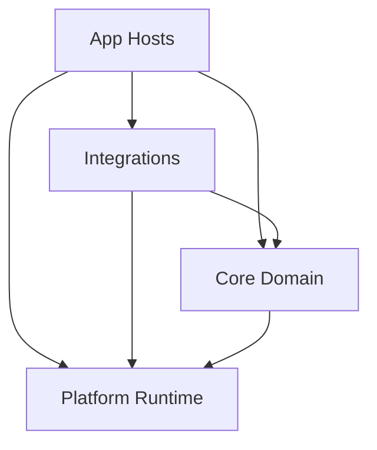
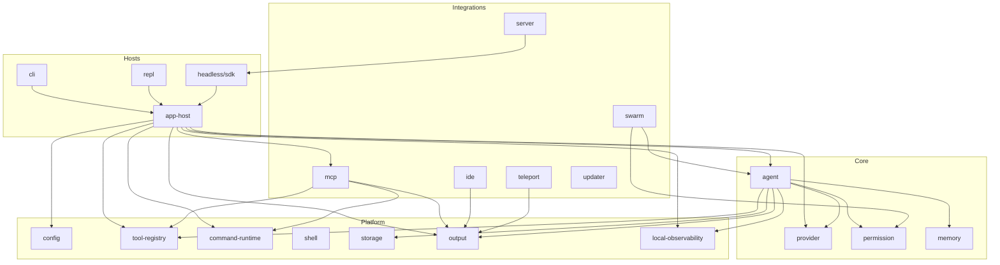
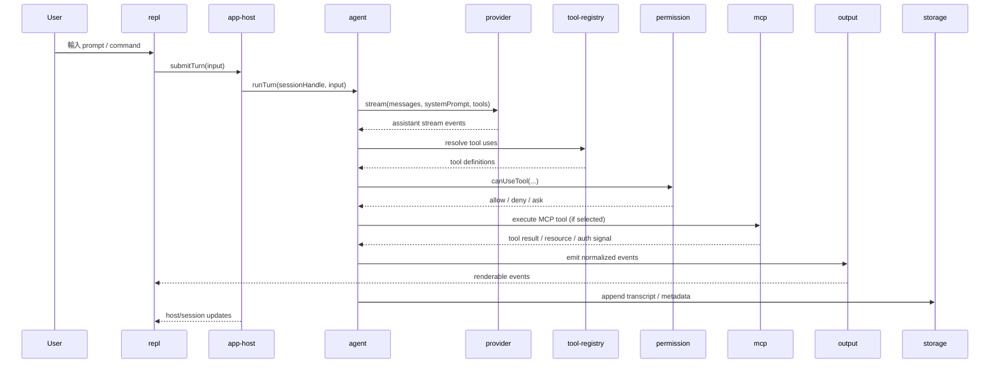
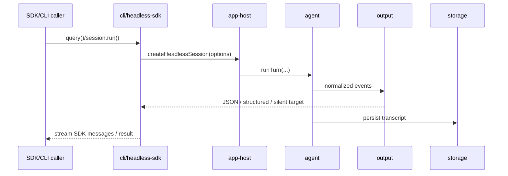
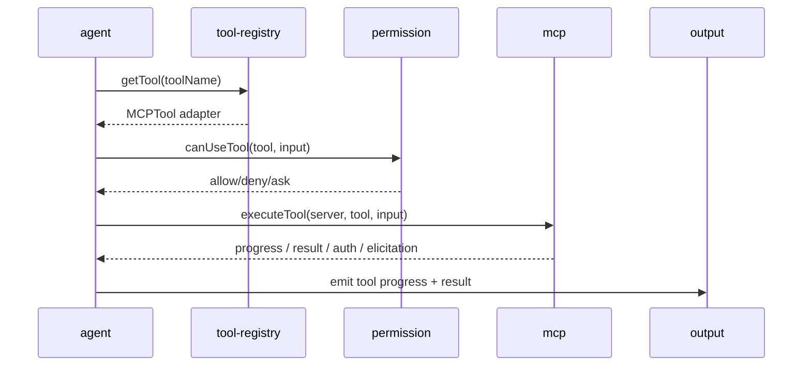
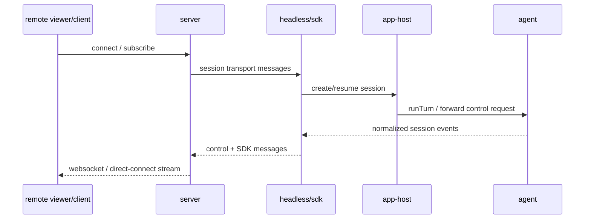

# Claude Code Canonical Architecture

## 1. Why This Document Exists

本文件是 Claude Code 重構的唯一架構判準。

它只回答四件事：

- 終局架構長什麼樣
- 每個子系統的責任、邊界、依賴方向是什麼
- 目前 repo 與終局架構之間的 gap 是什麼
- 重構完成時，什麼叫做真正完成

本文件不是 roadmap、不是 phase list、不是 PR worklog、不是關帳報告。
任何帶有時間性的「已完成 / 可關帳 / 下一階段 / 本輪完成」敘述，都不作為架構判準。

---

## 2. Design Goals

### 2.1 外部契約完全不變

- CLI 介面、參數、flags、exit semantics 保持不變
- SDK surface、訊息格式、session file 格式、設定格式保持不變
- 所有 features 保留，包括 REPL、headless、SDK、MCP、plugin/skill、swarm、remote/direct-connect、teleport、updater 等現有能力
- 使用者感知到的行為、輸出、權限流程、資料檔案相容性都不應因重構改變

### 2.2 內部徹底去屎山化

- 消滅 god files、god components、god stores
- 消滅假的 package seam
- 消滅 root `src/` 作為隱形 monolith owner 的狀態
- 每個系統只有一個真正 owner

### 2.3 可擴展而不是可堆疊

- 新 provider、新 host、新 integration、新 runtime target 應透過 contracts 擴展
- 新功能不應再靠把更多條件分支塞進 `main.tsx`、`REPL.tsx`、`print.ts`、`QueryEngine.ts`

### 2.4 先有乾淨架構，再有大規模搬遷

- 先定義 canonical ownership、ports、data flow、state boundaries
- 再做 code move
- 不允許一邊搬一邊重新發明架構

---

## 3. Architecture Principles

### 3.1 Owner Over Shim

- shim、wrapper、host binding、compat facade 不是 owner
- 有 package 不代表完成，只有 implementation ownership 轉移才算完成
- 一個 root 檔案如果仍掌握核心決策與流程編排，它就是 owner，不管外面包了多少 package

### 3.2 Ports And Adapters

- Core Domain 只依賴 contracts，不依賴 UI、host、integration 細節
- 平台能力與外部系統接線透過 ports 注入
- provider、tool、command、MCP、output、storage 都必須以可替換 contract 存在

### 3.3 Thin Hosts

- `main.tsx` 只做 bootstrap / render / wiring
- `REPL.tsx` 只做 UI 組裝與 interaction orchestration
- headless/SDK host 只做 transport、session wiring、output routing
- host 可以協調，不得擁有 domain business logic

### 3.4 State Lives With Its Owner

- conversation state 屬於 `agent`
- permission state 屬於 `permission`
- MCP connection/resource state 屬於 `mcp`
- UI local state 屬於 `repl`
- session persistence 屬於 `storage`
- `AppState` 不是終局架構，只能是過渡載體

### 3.5 Real Package Boundaries

- 正式 package 不得依賴 `@cc-app/*`
- 正式 package 不得依賴 root `src/*`
- package 對外只能透過 public exports 暴露能力
- package 之間只能依賴彼此公開 contract，不得吃對方 internal file path

### 3.6 Local, Pluggable Observability

- 保留 logger、diagnostics、trace、metrics、health contracts
- 預設只允許 local sink、file sink、null sink
- feature flags 屬於 `config`
- 外送 telemetry 不能成為核心依賴，也不能污染 domain APIs

---

## 4. External Compatibility Contract

以下內容屬於不可破壞契約：

- `src/entrypoints/agentSdkTypes.ts` 對外公開的 SDK 型別與能力語義
- 既有 session transcript / JSONL / metadata 持久化格式
- CLI 與 headless mode 的輸出與控制流程語義
- 權限提示行為與 deny/allow/ask 基本決策模型
- MCP server config 與載入行為的使用者表面
- 既有 command/tool 名稱、alias、基本行為語義
- 設定讀取優先級與檔案位置

重構允許：

- 內部 owner 轉移
- interface 正式化
- host wiring 重組
- state 拆分
- compat wrapper 暫留

重構不允許：

- 變更外部 API surface
- 變更外部檔案格式
- 改變預設用戶體驗
- 以「架構比較乾淨」為由拿掉 feature

---

## 5. Canonical Architecture

### 5.1 System Layers

#### Core Domain

- `agent`
- `provider`
- `permission`
- `memory`

#### Platform Runtime

- `config`
- `tool-registry`
- `command-runtime`
- `shell`
- `storage`
- `output`
- `local-observability`

#### Integrations

- `mcp`
- `swarm`
- `ide`
- `teleport`
- `updater`
- `server`

#### App Hosts

- `app-host`
- `cli`
- `repl`
- `headless/sdk`

### 5.2 Layer Intent

#### Core Domain

負責 Claude Code 的核心業務能力：

- 對話 turn loop
- provider 統一抽象
- 權限決策
- 記憶提取與整合

#### Platform Runtime

負責被多個 domain 與 host 共用的基礎設施：

- 設定
- tool / command registration
- shell execution
- storage
- output target
- diagnostics / health

#### Integrations

負責與外部系統或擴展環境接合：

- MCP
- multi-agent/swarm
- IDE
- teleport/remote execution
- updater
- server/direct-connect

#### App Hosts

負責啟動、組裝、render、transport 與互動入口：

- interactive terminal UI
- non-interactive/headless
- SDK/session host
- composition root

### 5.3 Top-Level Dependency Diagram



### 5.4 System Map



---

## 6. Primary Execution Flows

本節不是實作細節，而是終局系統必須滿足的 canonical data flow。

### 6.1 Interactive REPL Turn



### 6.2 Headless / SDK Turn



### 6.3 MCP Tool Call Flow



### 6.4 Remote / Direct-Connect Flow



---

## 7. State Ownership Model

### 7.1 Canonical State Partition

| State Category | Final Owner | Notes |
| --- | --- | --- |
| Conversation transcript, turn count, per-session usage | `agent` | 不是 `AppState` |
| Provider auth/cache/model availability/context pipeline state | `provider` | host 只注入 port |
| Tool permission rules / mode / deny-allow-ask context | `permission` | UI prompt 不是 owner |
| Memory retrieval / extraction / consolidation state | `memory` | 可持久化但不掛在 host store |
| Tool registrations / aliases / provider bindings | `tool-registry` | registry 為 source of truth |
| Command registrations / providers / skills / plugin commands | `command-runtime` | command discovery 不屬於 REPL |
| MCP clients / auth / resources / commands / tool adapters | `mcp` | 不應掛在 monolithic `AppState` |
| Session persistence / transcript store / metadata store | `storage` | append-only journal + read models |
| Render pipeline / output buffering / JSON formatting | `output` | 不在 `print.ts` 或 UI 裡硬編 |
| Diagnostics / trace / metrics / health | `local-observability` | 不污染 domain |
| Host session UI state、transport state、focus state | `repl` / `cli` / `headless/sdk` | host-owned |
| Composition / runtime handles / dependency graph | `app-host` | 只保存 handles，不保存業務狀態 |

### 7.2 Final Rule For `AppState`

`AppState` 不是終局設計的一部分。

終局狀態應拆成三類：

1. Host Session Store
   - host 顯示與 transport 需要的 session-level state
   - 例如：目前聚焦 task、當前連線狀態、目前顯示中的 dialog、footer 狀態

2. Domain Runtime Handles
   - 由 app-host 持有對 `agent` / `mcp` / `permission` / `memory` 等 runtime 的 references
   - host 透過 API 讀寫，而不是直接攤平成單一 mega-state

3. Pure UI Local State
   - component-local state
   - 不應上升到全域 store

### 7.3 Current Repo Implication

目前 `src/state/AppStateStore.ts` 混入：

- host UI state
- MCP runtime state
- permission state
- plugin state
- remote/direct-connect state
- session runtime state
- auxiliary integration state

這種結構只能當過渡層，不可視為目標架構。

---

## 8. Subsystem Blueprints

本節是終局設計圖紙。每個 subsystem 都定義：

- `Purpose`
- `Owns`
- `Internal Structure`
- `Public Contracts`
- `Depends On`
- `Must Not Depend On`

### 8.1 `app-host`

**Purpose**

作為 composition root，負責組裝所有 package、安裝 host bindings、構造 runtime、暴露 host-specific entrypoints。

**Owns**

- bootstrap
- dependency composition
- host bindings installation
- runtime factory
- compat facade wiring

**Internal Structure**

- `bootstrap/`
  - env/bootstrap
  - feature gate bootstrap
  - startup initialization
- `composition/`
  - provider runtime factory
  - agent runtime factory
  - mcp runtime factory
  - output target factory
- `host-bindings/`
  - provider bindings
  - tool registry bindings
  - command runtime bindings
  - cli bindings
- `session/`
  - host session handle
  - runtime handle registry
  - compat session adapters
- `entrypoints/`
  - interactive host entry
  - headless host entry
  - remote/direct-connect host entry

**Public Contracts**

- `createInteractiveHost(...)`
- `createHeadlessHost(...)`
- `createRemoteHost(...)`
- `installHostBindings(...)`
- `createRuntimeGraph(...)`

**Depends On**

- Core Domain
- Platform Runtime
- Integrations

**Must Not Depend On**

- duplicated business logic
- UI rendering details
- domain-internal implementations beyond public APIs

### 8.2 `agent`

**Purpose**

提供 provider-agnostic 的核心對話引擎與 session lifecycle。

**Owns**

- `query`
- `QueryEngine`
- turn loop
- hook lifecycle
- compaction
- scheduler/cron
- session runtime state

**Internal Structure**

- `contracts/`
  - messages
  - events
  - tool contracts
  - dependency ports
- `session/`
  - session runtime
  - transcript state
  - usage aggregation
- `turn/`
  - turn orchestration
  - request lifecycle
  - stop conditions
  - retry/recovery policy
- `hooks/`
  - stop hooks
  - post-sampling hooks
  - session hooks
- `compaction/`
  - compact strategies
  - token window management
- `scheduler/`
  - cron scheduler
  - scheduled tasks
- `adapters/compat/`
  - root compat shims while migration is ongoing

**Public Contracts**

- `query(...)`
- `QueryEngine`
- `AgentDeps`
- `AgentEvent`
- `HookLifecycle`
- `CompactionService`
- `CronScheduler`

**Depends On**

- `provider`
- `permission`
- `memory`
- `tool-registry`
- `output`
- `storage`
- `local-observability`

**Must Not Depend On**

- React / Ink
- CLI transport
- MCP runtime implementation details
- root app state
- `main.tsx` / `REPL.tsx`

### 8.3 `provider`

**Purpose**

將 Anthropic / OpenAI / Gemini / Grok / Bedrock / Vertex / Foundry 等模型供應者統一成可替換介面。

**Owns**

- provider registry
- provider adapters
- auth providers
- context pipeline
- network layer
- stream normalization

**Internal Structure**

- `contracts/`
  - `ProviderAdapter`
  - `AuthProvider`
  - `ContextProvider`
  - `NetworkLayer`
  - normalized stream/message types
- `registry/`
  - provider resolution
  - model option listing
- `adapters/`
  - `anthropic/`
  - `openai/`
  - `gemini/`
  - `grok/`
  - cloud-backed anthropic variants
- `auth/`
  - OAuth/API key/subscriber/cloud credential resolution
- `context/`
  - user context providers
  - system context providers
  - ordering / priority
- `network/`
  - proxy handling
  - http client creation
  - retry/policy
- `compat/`
  - root `claude.ts` thin facade only

**Public Contracts**

- `ProviderAdapter`
- `AuthProvider`
- `ContextProvider`
- `NetworkLayer`
- `getProviderAdapter(...)`
- `listModels(...)`

**Depends On**

- `config`
- `local-observability`

**Must Not Depend On**

- root `src/services/api/*`
- REPL / CLI / main wiring
- host-local state

### 8.4 `permission`

**Purpose**

提供獨立、可測試的權限判定與規則系統。

**Owns**

- permission mode
- rule store
- deny/allow/ask policy
- dangerous permission analysis
- auto mode gate
- permission context transforms

**Internal Structure**

- `contracts/`
  - permission context
  - decision result
  - policy input
- `rules/`
  - parse
  - normalize
  - persist
  - source precedence
- `pipeline/`
  - rule evaluation
  - auto classifier
  - tool input safety checks
- `prompts/`
  - permission prompt schemas
  - prompt result mapping
- `filesystem/`
  - path safety
  - working directory policy

**Public Contracts**

- `PermissionMode`
- `ToolPermissionContext`
- `checkRuleBasedPermissions(...)`
- `initializeToolPermissionContext(...)`
- permission update / persistence APIs

**Depends On**

- `config`
- `local-observability`

**Must Not Depend On**

- UI permission dialogs
- REPL internal state
- root tool implementations

### 8.5 `memory`

**Purpose**

提供專案與 agent 記憶的存取、檢索、提取、合併能力。

**Owns**

- memory source resolution
- memory path APIs
- relevant memory lookup
- extraction
- consolidation
- sync policy

**Internal Structure**

- `contracts/`
  - memory source
  - memory record
  - extraction/consolidation policy
- `paths/`
  - session/project/global memory path resolution
- `recall/`
  - relevant memory discovery
  - prefetch
- `extract/`
  - turn-to-memory extraction
- `consolidate/`
  - summary and merge rules
- `sync/`
  - project/global sync

**Public Contracts**

- memory path APIs
- relevant memory lookup APIs
- extract / consolidate APIs
- sync trigger APIs

**Depends On**

- `config`
- `storage`
- `local-observability`

**Must Not Depend On**

- REPL UI
- app state
- root task/tool registration

### 8.6 `config`

**Purpose**

作為最底層配置與 feature-flag 基礎設施。

**Owns**

- settings manager
- settings source precedence
- watchers/change detection
- feature flag provider
- global config
- managed settings sync entry contracts

**Internal Structure**

- `settings/`
  - parse
  - validate
  - precedence
  - read/write/watch
- `feature-flags/`
  - local overrides
  - cached reads
  - refresh notifications
- `managed/`
  - managed settings contract
  - remote-managed bridge interface
- `global/`
  - global config read/write

**Public Contracts**

- settings read / write / watch APIs
- feature flag read / refresh APIs
- global config APIs

**Depends On**

- `local-observability`

**Must Not Depend On**

- REPL
- main runtime orchestration
- business-domain-specific state

### 8.7 `tool-registry`

**Purpose**

作為所有 tool discovery、registration、policy gating 的單一來源。

**Owns**

- built-in tool registration
- MCP tool registration
- plugin tool registration
- user tool registration
- tool alias resolution
- registry-level pool assembly

**Internal Structure**

- `contracts/`
  - tool provider
  - tool registration
  - registry host bindings
- `registry/`
  - canonical registry store
  - alias index
  - category index
- `providers/`
  - built-in provider
  - plugin provider
  - MCP provider adapter
  - user provider
- `policy/`
  - deny-rule filtering
  - mode-aware filtering
  - dedup / sort / final pool

**Public Contracts**

- `ToolRegistry`
- `ToolProvider`
- `getToolRegistry()`
- `getTools(...)`
- `assembleToolPool(...)`

**Depends On**

- `permission`
- `config`

**Must Not Depend On**

- root `src/tools.ts`
- REPL mode branching logic ownership
- host-specific tool ownership

### 8.8 `command-runtime`

**Purpose**

作為所有 command discovery、availability、skill/command 匯流的單一來源。

**Owns**

- built-in command registration
- plugin command registration
- skill command registration
- MCP-provided command registration
- command lookup
- command capability metadata

**Internal Structure**

- `contracts/`
  - command provider
  - command metadata
  - resolver contracts
- `registry/`
  - canonical command store
  - alias / name resolution
- `providers/`
  - built-in
  - plugin
  - skill
  - MCP
- `resolver/`
  - enabled-state checks
  - command selection
  - conflict policy

**Public Contracts**

- `getCommands(...)`
- `findCommand(...)`
- `hasCommand(...)`
- `getCommand(...)`
- `getMcpSkillCommands(...)`

**Depends On**

- `config`
- `local-observability`

**Must Not Depend On**

- root `src/commands.ts`
- REPL UI logic
- host-specific command wiring

### 8.9 `shell`

**Purpose**

提供跨 shell 的執行抽象與命令包裝能力。

**Owns**

- shell discovery
- parser/quoting/prefixing
- subprocess env construction
- bash/zsh/powershell providers
- execution helpers

**Internal Structure**

- `providers/`
  - bash
  - powershell
  - default shell resolution
- `parser/`
  - AST / command analysis
  - read-only validation
- `exec/`
  - execution
  - output caps
  - environment shaping

**Public Contracts**

- `ShellProvider`
- `exec(...)`
- shell discovery APIs
- quoting / prefix helpers

**Depends On**

- `local-observability`

**Must Not Depend On**

- REPL
- BashTool ownership
- host runtime ownership

### 8.10 `storage`

**Purpose**

提供 session / transcript / metadata / cache persistence 的統一 backend abstraction。

**Owns**

- transcript store
- session metadata store
- append-only journal
- resource/blob persistence
- backend abstraction

**Internal Structure**

- `contracts/`
  - `StorageBackend`
  - object handles / query filters
- `backends/`
  - local file
  - memory
  - remote/API
- `stores/`
  - transcript store
  - session metadata store
  - artifact/blob store
- `serialization/`
  - codec / schema versioning

**Public Contracts**

- `StorageBackend`
- `read`
- `write`
- `append`
- `delete`
- `list`
- transcript/session store APIs

**Depends On**

- `config`
- `local-observability`

**Must Not Depend On**

- JSONL-specific root utilities
- session UI
- transport layer

### 8.11 `output`

**Purpose**

提供統一輸出抽象，讓 agent/runtime 事件可被不同 host/render target 消費。

**Owns**

- normalized output event model
- terminal output target
- JSON output target
- silent output target
- output formatting strategies

**Internal Structure**

- `contracts/`
  - `OutputEvent`
  - `OutputTarget`
- `targets/`
  - terminal
  - json
  - silent
  - remote/session bridge
- `formatters/`
  - assistant/system/tool/permission events
  - structured output enforcement
- `buffers/`
  - partial stream handling
  - replay / resume aware buffering

**Public Contracts**

- `OutputTarget`
- `renderMessage`
- `renderToolProgress`
- `renderError`
- `renderPermission`
- `emit(event)`

**Depends On**

- `local-observability`

**Must Not Depend On**

- REPL component tree
- SDK transport specifics
- root `print.ts` ownership

### 8.12 `local-observability`

**Purpose**

提供本地可插拔的診斷與健康檢查能力，不承擔外送 telemetry 職責。

**Owns**

- logger
- diagnostics sink
- tracer/span abstraction
- metrics recorder
- health probe

**Internal Structure**

- `logging/`
  - structured logger
  - debug sinks
- `trace/`
  - spans
  - timing
- `metrics/`
  - counters
  - histograms
- `health/`
  - probes
  - runtime checks
- `sinks/`
  - stderr
  - file
  - null

**Public Contracts**

- logging APIs
- trace/span APIs
- health reporting APIs
- metrics APIs

**Depends On**

- none or minimal utility-only deps

**Must Not Depend On**

- third-party analytics exporters
- feature flags
- app business logic

### 8.13 `mcp`

**Purpose**

作為 MCP transport、auth、discovery、runtime lifecycle 的正式 integration subsystem。

**Owns**

- config resolution
- transport factory
- auth / reconnect
- client lifecycle
- tool discovery
- command discovery
- resource discovery / prefetch
- MCP execution runtime

**Internal Structure**

- `contracts/`
  - MCP config
  - client handle
  - discovery result
  - runtime event model
- `config/`
  - local/user/project/sdk config merge
  - disabled/allowlist policy
- `transport/`
  - stdio
  - sse
  - streamable-http
  - websocket
- `auth/`
  - oauth/session auth
  - step-up/retry
  - cache
- `clients/`
  - connection manager
  - reconnect
  - lifecycle
- `discovery/`
  - tools
  - commands
  - prompts/resources
- `runtime/`
  - tool adapter execution
  - resource prefetch
  - elicitation / auth-required signals
- `bridges/`
  - registry adapter
  - host notification adapter

**Public Contracts**

- `McpRuntime`
- discovery APIs
- `executeTool(...)`
- `connectAll(...)`
- `prefetchResources(...)`
- auth/session APIs

**Depends On**

- `config`
- `tool-registry`
- `command-runtime`
- `output`
- `local-observability`

**Must Not Depend On**

- REPL ownership
- `main.tsx`
- root app orchestration

### 8.14 `swarm`

**Purpose**

提供多 agent 協調、mailbox、permission sync、worktree orchestration。

**Owns**

- teammate runtime orchestration
- backend registry
- mailbox
- worktree coordination
- leader/worker permission bridge

**Internal Structure**

- `backends/`
  - tmux
  - iTerm
  - in-process
- `runtime/`
  - spawn / reconnect / lifecycle
- `mailbox/`
  - inbox/outbox
- `permissions/`
  - leader permission bridge
- `worktree/`
  - worktree management

**Public Contracts**

- swarm host deps
- teammate lifecycle APIs
- mailbox APIs

**Depends On**

- `agent`
- `permission`
- `output`
- `local-observability`

**Must Not Depend On**

- REPL ownership
- root task ownership

### 8.15 `ide`

**Purpose**

提供 IDE 與編輯器整合，包括選區、高亮、LSP、code indexing。

**Owns**

- IDE connectors
- editor bridge
- selection/highlight
- diagnostics/indexing bridge

**Internal Structure**

- `connectors/`
  - VS Code
  - JetBrains
  - other editor adapters
- `lsp/`
  - request/response bridge
- `indexing/`
  - code index handle

**Public Contracts**

- `IDEConnector`
- open / highlight / selection APIs
- diagnostics / indexing APIs

**Depends On**

- `output`
- `local-observability`

**Must Not Depend On**

- REPL internal state
- main startup ownership

### 8.16 `teleport`

**Purpose**

提供遠端執行與上下文打包同步能力。

**Owns**

- environment selection
- context packing
- remote execution bridge
- result sync

**Internal Structure**

- `providers/`
  - teleport backends
- `packing/`
  - git context / workspace packaging
- `execution/`
  - remote run orchestration
- `sync/`
  - result transport back

**Public Contracts**

- teleport execution APIs
- environment selection APIs

**Depends On**

- `storage`
- `output`
- `local-observability`

**Must Not Depend On**

- REPL UI
- root command implementation ownership

### 8.17 `updater`

**Purpose**

提供安裝檢測、自動更新、原生安裝器協調能力。

**Owns**

- update check
- installer/invoker
- binary verification
- upgrade coordination

**Internal Structure**

- `check/`
  - version resolution
  - availability policy
- `install/`
  - installer drivers
  - postinstall
- `verify/`
  - checksum / binary validation

**Public Contracts**

- update check APIs
- installer APIs

**Depends On**

- `config`
- `local-observability`

**Must Not Depend On**

- main business logic
- REPL state

### 8.18 `server`

**Purpose**

提供可選的服務器模式與 direct-connect coordination。

**Owns**

- server lifecycle
- direct-connect session transport
- session coordination/locks

**Internal Structure**

- `transport/`
  - websocket / rpc / control channel
- `session/`
  - remote session manager
  - control request routing
- `coordination/`
  - locks / reconnect / resume

**Public Contracts**

- server start / stop APIs
- remote session transport APIs
- session management APIs

**Depends On**

- `headless/sdk`
- `output`
- `local-observability`

**Must Not Depend On**

- REPL ownership
- root host orchestration

### 8.19 `cli`

**Purpose**

作為 command-line host，提供 transport、structured I/O、subcommand entry。

**Owns**

- CLI argument parsing
- CLI subcommand host
- structured/stdout IO transport
- rollback-capable host actions

**Internal Structure**

- `entry/`
  - CLI bootstrap
  - command parsing
- `transport/`
  - stdio
  - structured IO
  - remote IO
- `session/`
  - headless session launcher
  - resume/fork wiring
- `commands/`
  - host-only subcommands

**Public Contracts**

- CLI transport exports
- headless host session APIs
- CLI host bindings

**Depends On**

- `app-host`
- `output`
- `storage`

**Must Not Depend On**

- root REPL implementation ownership
- root app state ownership

### 8.20 `repl`

**Purpose**

作為 interactive UI host，只負責 UI state、render tree、interaction orchestration。

**Owns**

- transcript rendering
- input/prompt UI
- dialog orchestration
- focus/selection state
- view models

**Internal Structure**

- `components/`
  - presentational UI
- `view-models/`
  - transcript VM
  - prompt VM
  - dialog VM
- `controllers/`
  - input orchestration
  - keyboard routing
  - host event subscription
- `screens/`
  - top-level REPL shell

**Public Contracts**

- REPL host props
- UI composition entry
- view-model contracts

**Depends On**

- `app-host`
- `output`
- `local-observability`

**Must Not Depend On**

- core domain ownership
- provider ownership
- MCP runtime ownership
- tool / command ownership

### 8.21 `headless/sdk`

**Purpose**

作為非互動 host，提供 JSON/programmatic access，不經 Ink UI。

**Owns**

- SDK-facing session APIs
- event streaming adapters
- control protocol adapters
- resume/fork/headless run adapters

**Internal Structure**

- `session/`
  - create/resume/fork session
- `streaming/`
  - event stream adapter
  - partial message handling
- `control/`
  - permission/control requests
  - MCP server injection
- `compat/`
  - SDK message adapters

**Public Contracts**

- headless run APIs
- session APIs
- SDK-friendly event surfaces

**Depends On**

- `app-host`
- `output`
- `storage`
- `server` when direct-connect mode is used

**Must Not Depend On**

- REPL UI
- root app state ownership

---

## 9. Canonical Interfaces

本節不是最終 TypeScript 檔案，而是終局 contract 的最低要求。

### 9.1 `app-host`

```ts
type AppHostRuntime = {
  createInteractiveHost(options: InteractiveHostOptions): InteractiveHost
  createHeadlessHost(options: HeadlessHostOptions): HeadlessHost
  createRemoteHost(options: RemoteHostOptions): RemoteHost
}
```

### 9.2 `agent`

```ts
type QueryEngine = {
  submit(input: UserTurnInput): AsyncIterable<AgentEvent>
  interrupt(): void
  getState(): AgentSessionSnapshot
}
```

### 9.3 `provider`

```ts
type ProviderAdapter = {
  id: string
  query(args: ProviderQueryArgs): Promise<ProviderAssistantMessage>
  queryStream(args: ProviderQueryArgs): AsyncIterable<ProviderEvent>
  listModels(fastMode?: boolean): ProviderModelOption[]
  isAvailable(context?: ProviderAuthContext): Promise<ProviderAvailability>
}
```

### 9.4 `tool-registry`

```ts
type ToolRegistry = {
  register(tool: ToolDefinition, category: ToolCategory, provider: string): void
  unregister(name: string): boolean
  get(name: string): ToolDefinition | undefined
  getAll(): ToolDefinition[]
  assemblePool(ctx: ToolPermissionContext): ToolDefinition[]
}
```

### 9.5 `command-runtime`

```ts
type CommandRuntime = {
  getCommands(cwd: string): Promise<CommandDefinition[]>
  find(name: string, commands: CommandDefinition[]): CommandDefinition | undefined
  get(name: string, commands: CommandDefinition[]): CommandDefinition
}
```

### 9.6 `mcp`

```ts
type McpRuntime = {
  connectAll(configs: Record<string, McpServerConfig>): Promise<McpConnection[]>
  discover(configs?: Record<string, McpServerConfig>): Promise<McpDiscoverySnapshot>
  executeTool(call: McpToolCall): Promise<McpToolResult>
  prefetchResources(configs: Record<string, McpServerConfig>): Promise<McpResourceSnapshot>
}
```

### 9.7 `storage`

```ts
type StorageBackend = {
  read(path: string): Promise<Uint8Array | string | null>
  write(path: string, data: Uint8Array | string): Promise<void>
  append(path: string, data: Uint8Array | string): Promise<void>
  delete(path: string): Promise<void>
  list(path: string): Promise<string[]>
}
```

### 9.8 `output`

```ts
type OutputTarget = {
  emit(event: OutputEvent): Promise<void> | void
  flush?(): Promise<void>
  close?(): Promise<void>
}
```

### 9.9 `local-observability`

```ts
type LocalObservability = {
  logger: Logger
  tracer: Tracer
  metrics: MetricsRecorder
  health: HealthProbe
}
```

---

## 10. Root Module Landing Map

這一節定義現有 root ownership 在終局架構中的落點。這是後續 code move 的施工藍圖。

| Current Root Module | Final Owner | Final Fate |
| --- | --- | --- |
| `src/main.tsx` | `repl` + `app-host` | 拆為 UI host shell 與 bootstrap wiring |
| `src/screens/REPL.tsx` | `repl` | 拆為 screen/controller/view-model，不再擁有業務流程 |
| `src/query.ts` | `agent` | 遷入 `agent/turn` 與 `agent/query` |
| `src/QueryEngine.ts` | `agent` | 遷入 `agent/session`；root 只留 compat facade |
| `src/agent/createDeps.ts` | `app-host` + `agent` | dep wiring 留 app-host，message/event mapping 進 compat layer |
| `src/services/api/claude.ts` | `provider` | 壓成薄 compat facade |
| `src/services/api/claudeLegacy.ts` | `provider` | 拆入 provider internals；compat wrapper 最終刪除 |
| `src/services/api/providerHostSetup.ts` | `app-host` | 保留 host binding install，不承載 provider business logic |
| `src/tools.ts` | `tool-registry` + `app-host` | policy/registry 進 package；host install 留 app-host |
| `src/commands.ts` | `command-runtime` + `app-host` | built-in registry 進 package；host install 留 app-host |
| `src/services/mcp/client.ts` | `mcp` | 成為正式 MCP runtime owner |
| `src/cli/print.ts` | `cli` + `headless/sdk` + `output` + `app-host` | 拆分 transport、session host、output target、wiring |
| `src/remote/RemoteSessionManager.ts` | `server` | 成為 direct-connect/session transport owner |
| `src/remote/sdkMessageAdapter.ts` | `headless/sdk` | 成為 SDK/remote message adapter |
| `src/state/AppStateStore.ts` | host stores + runtime handles | 解體，不作為終局 owner |
| `src/services/eventLogger.ts` | `local-observability` | 轉為 logger/diagnostics facade |
| `src/utils/telemetry/sessionTracing.ts` | `local-observability` | 轉為本地 trace abstraction |

---

## 11. Dependency Rules

### 11.1 Allowed

- Core Domain → Platform Runtime contracts
- Integrations → Core Domain
- Integrations → Platform Runtime
- App Hosts → Core Domain
- App Hosts → Platform Runtime
- App Hosts → Integrations

### 11.2 Forbidden

- Core Domain → Integrations
- Core Domain → App Hosts
- Platform Runtime → App Hosts
- Integrations → App Hosts internals
- Any formal package → `@cc-app/*`
- Any formal package → root `src/*`
- REPL / CLI / headless host → provider-internal implementation files
- Tool / command / provider / MCP owner logic → `main.tsx` / `REPL.tsx`

### 11.3 Boundary Clarifications

- `app-host` 是唯一可以同時看到 core/platform/integration 的層
- `repl`、`cli`、`headless/sdk` 看的是 `app-host` 暴露的 host/session APIs，不直接摸 domain internals
- `tool-registry` 與 `command-runtime` 是平台層，不是 UI helper
- `mcp` 是 integration，不是 registry 的內部細節
- `storage` 與 `output` 都是平台 contract，不屬於 host

---

## 12. Non-Negotiables

- 外部 CLI、SDK、設定格式、檔案格式、功能行為不變
- 正式 package 不得依賴 `@cc-app/*`
- 正式 package 不得依賴 root `src/*`
- `main.tsx` 不得持有核心業務所有權
- `REPL.tsx` 不得持有核心業務所有權
- `print.ts` 不得持有 agent / provider / MCP / registry 的 owner logic
- Core Domain 不得依賴 integration 或 app host
- observability 採本地可插拔模式，不以外送 telemetry 為核心依賴
- shim、host binding、compat wrapper 不算 owner implementation
- `packages/app-host` 若保留，必須成為真正 composition root；不允許空 package 佔位

---

## 13. Current Repo vs Canonical Architecture

| Subsystem | Status | Current Repo State | Why It Does Not Yet Match | Convergence Condition |
| --- | --- | --- | --- | --- |
| `agent` | `Partially Aligned` | 有 `packages/agent`，但 `src/query.ts` 與 `src/QueryEngine.ts` 仍是實際 owner；`src/agent/createDeps.ts` 仍做大量 adapter/wiring | 核心 turn/session logic 尚未完全 package-owned | `query` / `QueryEngine` / hooks / compaction / scheduler 全部以 package 為 owner，root 只留 compat facade |
| `provider` | `Partially Aligned` | `packages/provider` 已有 adapter/auth/network/context 雛形；OpenAI/Gemini/Grok 已抽出 | Anthropic 主路徑仍透過 `src/services/api/providerHostSetup.ts` 回綁 `claudeLegacy.ts`；context pipeline 仍只是 host passthrough | provider registry、auth、context pipeline、network、Anthropic path 全部 package-owned |
| `permission` | `Partially Aligned` | 有 `packages/permission` 與 public exports | package 仍大量反向依賴 `@cc-app/*`；例如直接使用 root event logger 等 | permission pipeline、rule store、dangerous permission logic 全脫離 root |
| `memory` | `Partially Aligned` | 有 `packages/memory` | package 仍不是獨立 owner，仍回吃 root 功能與 runtime | memory path/recall/extract/consolidate 由 package 完整擁有 |
| `config` | `Partially Aligned` | settings / feature flags / global config 已部分 package 化 | package 仍大量反向依賴 root utilities/services | config 成為真正底層設施，feature flags/settings/watchers 全 package-owned |
| `tool-registry` | `Partially Aligned` | 有 `packages/tool-registry` 與 `ToolRegistry` | `src/tools.ts` 仍掌握 built-in ownership、mode-aware policy 與 host binding 安裝 | registry 成為唯一 tool source of truth；`src/tools.ts` 降為 compat facade |
| `command-runtime` | `Misplaced` | `packages/command-registry` 目前主要是 host wrapper API | built-in command ownership 仍在 `src/commands.ts`；skill/plugin/MCP 匯流仍由 root 主導 | 形成真正的 command runtime owner module，`src/commands.ts` 僅作 compat facade |
| `shell` | `Aligned` | `packages/shell` 結構與抽象已接近終局，且無 `@cc-app/*` 回流 | 主要缺的是全系統統一改走 package surface | shell 維持 owner，不再由 root 重新包裝出平行邏輯 |
| `storage` | `Missing` | 無正式 package；session persistence 分散在 root utilities | 缺少統一 backend abstraction 與正式 owner | 建立 `storage` package 與 transcript/session/artifact stores |
| `output` | `Missing` | REPL/headless/JSON/remote 輸出路徑散在 `print.ts`、UI、SDK adapters | 缺少統一 `OutputTarget` 抽象與事件模型 | 建立 `output` package 並讓 hosts 僅選 target |
| `local-observability` | `Misplaced` | diagnostics/debug/health 邏輯散在 root；`eventLogger` 與 `sessionTracing` 多為 no-op stub | 沒有單一 owner；舊 telemetry 命名污染概念 | 建立正式本地 observability package，收攏 logger/trace/metrics/health |
| `mcp` | `Misplaced` | 真實 runtime 在 `src/services/mcp/client.ts`；`packages/mcp-runtime` 只是 host wrapper | MCP 尚未成為正式 integration subsystem；連 discovery/auth/runtime 都還在 root | MCP transport/auth/discovery/runtime 全部成為單一 owner module |
| `swarm` | `Aligned` | `packages/swarm` 結構與依賴方向已接近目標，且無 `@cc-app/*` 回流 | app-side wiring 仍待收斂到 app-host | swarm 繼續維持 package owner，入口只保留 wiring |
| `ide` | `Missing` | IDE/LSP/Chrome integration 仍分散在 root | 無正式 package owner | 建立 `ide` package 與 connector contracts |
| `teleport` | `Misplaced` | teleport 能力仍在 root 命令與 utils | 無正式 package owner | 建立 `teleport` package |
| `updater` | `Misplaced` | update / installer / upgrade 能力散在 root scripts/commands/utils | 無正式 package owner | 建立 `updater` package |
| `server` | `Misplaced` | root 有 `src/server`、`src/remote`、direct-connect 相關實作，但無正式 owner | 仍是零散 transport/session code | 若保留，整理為 optional `server` integration package |
| `cli` | `Partially Aligned` | 有 `packages/cli` | package 仍大量使用 `@cc-app/*`；`src/cli/print.ts` 仍是真實 headless owner | CLI transport 與 host 啟動完全 package-owned |
| `repl` | `Misplaced` | `src/main.tsx` 與 `src/screens/REPL.tsx` 仍是超大 root host | UI host 與核心編排尚未分離 | REPL 只保留 view/controller/UI state，業務流程全部經 app-host/runtime APIs |
| `headless/sdk` | `Partially Aligned` | headless 路徑部分存在於 `packages/cli`，remote adapters 在 root `src/remote/*` | 仍依賴 root state、commands、print runtime、compat mappings | headless/sdk 成為乾淨非互動 host，保留外部 surface 不變 |
| `app-host` | `Misplaced` | `packages/app-host` 目錄存在但實際上是空的；host wiring 散在 `main.tsx`、`src/tools.ts`、`src/commands.ts`、`providerHostSetup.ts`、`print.ts` | composition root 尚未成形 | 建立正式 `app-host` package，接管所有 host binding install 與 runtime composition |

---

## 14. Definition Of Done

### 14.1 Structural Done

- `agent`、`provider`、`permission`、`memory`、`config`、`tool-registry`、`command-runtime`、`cli`、`mcp` 內 `@cc-app/*` import 為 `0`
- 上述 package 內對 root `src/*` import 為 `0`
- `packages/app-host` 成為正式 package，具有明確 public surface
- `storage`、`output`、`local-observability` 成為正式 package
- `main.tsx`、`REPL.tsx`、`print.ts` 不再持有 core/platform/integration owner logic

### 14.2 Ownership Done

- `src/query.ts`、`src/QueryEngine.ts` 不再是 agent owner
- `src/services/api/claudeLegacy.ts` 不再是 provider owner
- `src/tools.ts` 不再是 tool owner
- `src/commands.ts` 不再是 command owner
- `src/services/mcp/client.ts` 若保留 root facade，只能是薄 compat wrapper
- `AppState` 不再作為 domain/integration 的終局 owner store

### 14.3 Behavioral Done

- CLI / SDK / REPL / remote/direct-connect 對外行為完全一致
- session transcript / metadata / config file 相容
- tool / command / permission / MCP feature 行為一致
- fork/resume/replay/headless/JSON output 不退化

### 14.4 Test And Verification Done

- `bun run build`
- `bun test`
- `bun run health`
- provider smoke
- MCP smoke
- shell smoke
- swarm smoke
- interactive REPL smoke
- headless/SDK smoke
- remote/direct-connect smoke

### 14.5 Architectural Done

- 任何一位工程師只讀本文件，就能回答：
  - 某個模組屬於哪一層
  - 某個 root 檔案應該搬去哪個 owner
  - 某段狀態該屬於哪個 subsystem
  - 某個 package 能不能依賴另一個 package
- 不再需要用 phase 或歷史實作判斷架構

---

## 15. Deferred / Optional Subsystems

以下系統在終局架構中保留位置，但不應在核心骨架未收斂前提前擴張：

- `ide`
- `teleport`
- `updater`
- `server`

它們是 optional integrations，不得成為阻塞 Core Domain 與 Platform Runtime 收口的前置條件。

對這些系統的要求不是「先做完」，而是：

- 先定清楚 architectural slot
- 不允許再往 root `src/` 長新 owner logic
- 之後實作時直接進正式 package

---

## 16. Appendix: Historical Notes

以下內容屬於歷史資訊，不作為架構判準：

- 舊 `Phase 0-5`
- 舊 `6.0.x` roadmap / priority matrix
- 舊 inventory 中的文件行數快照
- 舊的「已完成 / 可關帳 / 下一階段」敘述
- 任何 PR / session / worklog 式完成描述

如需保留歷史施工紀錄，應另存於獨立文檔，而不是混入本文件主體。
