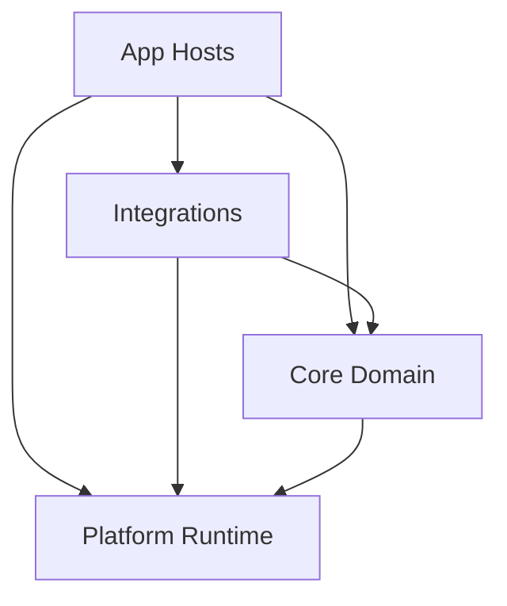
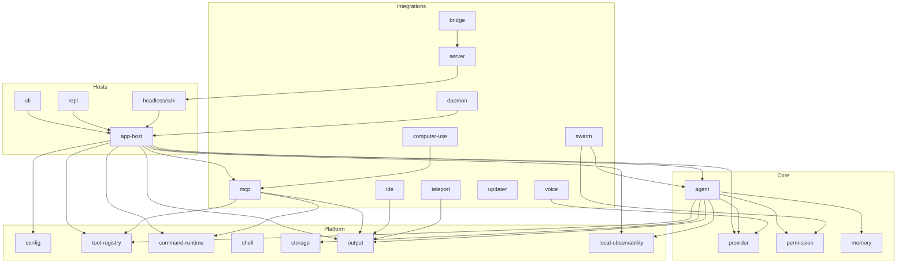
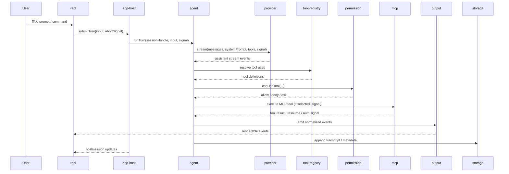
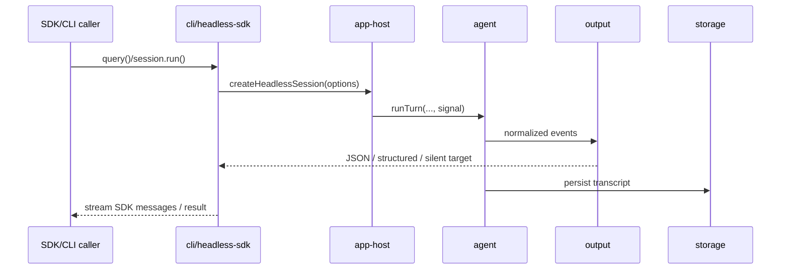
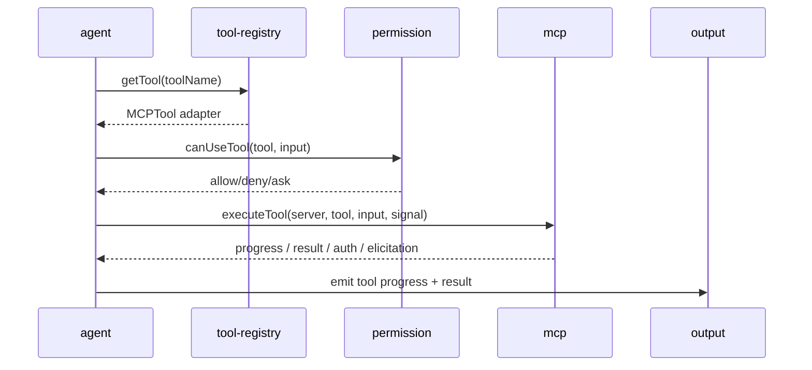
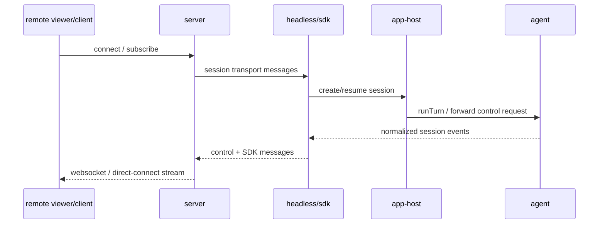
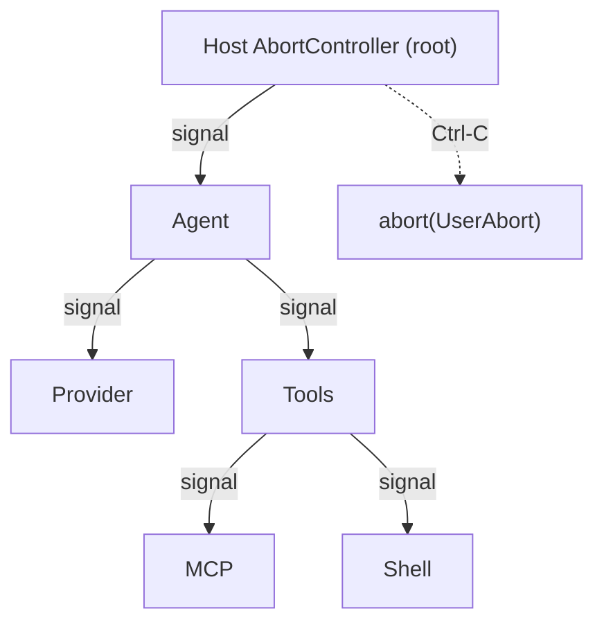

# Claude Code Canonical Architecture (V7)

> **This document is the blueprint. It does not describe current state.**
> For live status, run `bun run doctor:arch`. The doctor is the only
> authoritative source of "what is / isn't aligned today" — if the doctor
> passes, the rule holds; if it fails, the rule is broken. This file says
> what the rules *are*; the doctor says whether they hold.

## 1. Why This Document Exists

本文件是 Claude Code 重構的唯一架構判準。

它只回答三件事：

- 終局架構長什麼樣
- 每個子系統的責任、邊界、依賴方向是什麼
- 重構完成時，什麼叫做真正完成

它**不**回答：

- 目前 repo 符合度如何（問 `bun run doctor:arch`）
- phase / roadmap / PR 排序
- 「本輪完成什麼 / 下一階段做什麼」

任何帶有時間性的「已完成 / 可關帳 / 下一階段 / 本輪完成」敘述，都不作為架構判準。
當 V7 與 doctor 結果衝突時，**以 doctor 為準** — 因為 doctor 執行的是真實檔案系統與 import graph，V7 描述的是意圖。

### 1.1 關於 V6 → V7 的差異

V7 保留 V6 的：四層模型、subsystem ownership 規則、state partition、`Must Not Depend On` 子句、non-negotiables。

V7 修掉 V6 的：

1. **刪除 §13 狀態表** — 會腐壞的資訊交給 `bun run doctor:arch`，文件只保留規則。
2. **新增 §6.5 Cancellation / Error / Backpressure Contract** — V6 完全沒有定義這個 seam，但它決定 `main.tsx` 拆完之後能不能乾淨地 propagate abort 與錯誤。
3. **新增 §9.10 Event Spine** — V6 把 `AgentEvent`、`OutputEvent`、trace 視為三條獨立流；V7 定義它們的關係，避免 fork/resume/replay 日後要被硬塞進來。
4. **新增 §9.11 Testing Seams Policy** — 每個 contract owner 必須提供 fake / in-memory backend，否則 ports-and-adapters 就只是畫圖而已。
5. **§10 Landing Map 從 module-level 改為 section-level** — `main.tsx`（6604 行）與 `print.ts`（5600 行）不可能拆成「兩個 owner」，V7 給出 section-by-section 歸屬。
6. **System Map 承認真實存在的子系統** — Computer Use、Voice Mode、OpenAI 兼容、Gemini 兼容、Bridge mode、Daemon mode 在 V6 裡都不存在，V7 放在對應的 slot。
7. **§17 解釋 `@cc-app/*` 是什麼、為什麼被禁止** — V6 把它當 boogeyman 卻從來沒解釋。

---

## 2. Design Goals

### 2.1 外部契約完全不變

- CLI 介面、參數、flags、exit semantics 保持不變
- SDK surface、訊息格式、session file 格式、設定格式保持不變
- 所有 features 保留：REPL、headless、SDK、MCP、plugin/skill、swarm、remote/direct-connect、teleport、updater、Computer Use、Voice Mode、OpenAI 兼容、Gemini 兼容、Bridge、Daemon
- 使用者感知到的行為、輸出、權限流程、資料檔案相容性都不應因重構改變

### 2.2 內部徹底去屎山化

- 消滅 god files、god components、god stores
- 消滅假的 package seam
- 消滅 root `src/` 作為隱形 monolith owner 的狀態
- 每個系統只有一個真正 owner

### 2.3 可擴展而不是可堆疊

- 新 provider、新 host、新 integration、新 runtime target 應透過 contracts 擴展
- 新功能不應再靠把更多條件分支塞進 `main.tsx`、`REPL.tsx`、`print.ts`、`QueryEngine.ts`

### 2.4 先有乾淨架構，再有大規模搬遷

- 先定義 canonical ownership、ports、data flow、state boundaries
- 再做 code move
- 不允許一邊搬一邊重新發明架構

### 2.5 漂移必須機器可檢

- 每個結構規則要嘛是 doctor 可檢的，要嘛是非規則（僅供參考）
- 「V7 說的」如果無法用自動化工具驗證，就不應該被當成硬規則
- Cancellation/error/event-spine/testing-seams 是例外：它們是語意規則，需要 code review 守門

---

## 3. Architecture Principles

### 3.1 Owner Over Shim

- shim、wrapper、host binding、compat facade 不是 owner
- 有 package 不代表完成，只有 implementation ownership 轉移才算完成
- 一個 root 檔案如果仍掌握核心決策與流程編排，它就是 owner，不管外面包了多少 package

### 3.2 Ports And Adapters

- Core Domain 只依賴 contracts，不依賴 UI、host、integration 細節
- 平台能力與外部系統接線透過 ports 注入
- provider、tool、command、MCP、output、storage 都必須以可替換 contract 存在

### 3.3 Thin Hosts

- `main.tsx` 只做 bootstrap / render / wiring
- `REPL.tsx` 只做 UI 組裝與 interaction orchestration
- headless/SDK host 只做 transport、session wiring、output routing
- host 可以協調，不得擁有 domain business logic

### 3.4 State Lives With Its Owner

- conversation state 屬於 `agent`
- permission state 屬於 `permission`
- MCP connection/resource state 屬於 `mcp`
- UI local state 屬於 `repl`
- session persistence 屬於 `storage`
- `AppState` 不是終局架構，只能是過渡載體

### 3.5 Real Package Boundaries

- 正式 package 不得依賴 `@cc-app/*`（歷史 compat shim，見 §17）
- 正式 package 不得依賴 root `src/*`
- package 對外只能透過 public exports 暴露能力
- package 之間只能依賴彼此公開 contract，不得吃對方 internal file path

### 3.6 Local, Pluggable Observability

- 保留 logger、diagnostics、trace、metrics、health contracts
- 預設只允許 local sink、file sink、null sink
- feature flags 屬於 `config`
- 外送 telemetry 不能成為核心依賴，也不能污染 domain APIs

### 3.7 Cancellation Is A First-Class Contract

- 每一條跨越 host → agent → provider → tool → MCP 的呼叫必須透過 `AbortSignal` 傳遞取消
- Cancellation 是 cooperative：被取消的操作負責清理自己的 resource，不是 caller 強殺
- 任何產生 stream 的 API 必須 honour 下游的 `AbortSignal`
- 見 §6.5

### 3.8 Errors Are Typed, Not Strings

- 每個 subsystem owner 導出一個 error namespace（`ProviderError`, `PermissionError`, `ToolError`, `McpError`, `TransportError`, `StorageError`, `UserAbort`）
- Host 不得以字串匹配錯誤類型
- 見 §6.5

---

## 4. External Compatibility Contract

以下內容屬於不可破壞契約：

- `src/entrypoints/agentSdkTypes.ts` 對外公開的 SDK 型別與能力語義
- 既有 session transcript / JSONL / metadata 持久化格式
- CLI 與 headless mode 的輸出與控制流程語義
- 權限提示行為與 deny/allow/ask 基本決策模型
- MCP server config 與載入行為的使用者表面
- 既有 command/tool 名稱、alias、基本行為語義
- 設定讀取優先級與檔案位置
- Computer Use tool surface（macOS + Windows 的 screenshot / 鍵鼠 / 應用管理 API）
- Voice Mode push-to-talk 行為（包含 Anthropic OAuth 要求）
- OpenAI 兼容層環境變數（`CLAUDE_CODE_USE_OPENAI`, `OPENAI_*`）
- Gemini 兼容層環境變數（`CLAUDE_CODE_USE_GEMINI`, `GEMINI_*`）

重構允許：

- 內部 owner 轉移
- interface 正式化
- host wiring 重組
- state 拆分
- compat wrapper 暫留

重構不允許：

- 變更外部 API surface
- 變更外部檔案格式
- 改變預設用戶體驗
- 以「架構比較乾淨」為由拿掉 feature

---

## 5. Canonical Architecture

### 5.1 System Layers

#### Core Domain

- `agent`
- `provider`
- `permission`
- `memory`

#### Platform Runtime

- `config`
- `tool-registry`
- `command-runtime`
- `shell`
- `storage`
- `output`
- `local-observability`

#### Integrations

- `mcp`
- `swarm`
- `ide`
- `teleport`
- `updater`
- `server`
- `computer-use` *(previously invisible in V6)*
- `voice` *(previously invisible in V6)*
- `bridge` *(previously invisible in V6)*
- `daemon` *(previously invisible in V6)*

#### App Hosts

- `app-host`
- `cli`
- `repl`
- `headless/sdk`

### 5.2 Layer Intent

#### Core Domain

負責 Claude Code 的核心業務能力：

- 對話 turn loop
- provider 統一抽象（Anthropic / OpenAI / Gemini / Grok / Bedrock / Vertex / Foundry）
- 權限決策
- 記憶提取與整合

#### Platform Runtime

負責被多個 domain 與 host 共用的基礎設施：

- 設定 / feature flags
- tool / command registration
- shell execution
- storage
- output target
- diagnostics / health

#### Integrations

負責與外部系統或擴展環境接合：

- MCP
- multi-agent/swarm
- IDE
- teleport/remote execution
- updater
- server/direct-connect
- Computer Use（跨平台桌面操控）
- Voice Mode（Anthropic STT）
- Bridge mode（remote control）
- Daemon mode（長駐 supervisor）

#### App Hosts

負責啟動、組裝、render、transport 與互動入口：

- interactive terminal UI
- non-interactive/headless
- SDK/session host
- composition root

### 5.3 Top-Level Dependency Diagram



### 5.4 System Map



---

## 6. Primary Execution Flows

本節是終局系統必須滿足的 canonical data flow。

### 6.1 Interactive REPL Turn



### 6.2 Headless / SDK Turn



### 6.3 MCP Tool Call Flow



### 6.4 Remote / Direct-Connect Flow



### 6.5 Cancellation, Errors, Backpressure *(new in V7)*

這節補 V6 完全沒談的三個 seam — 它們決定 `main.tsx` 拆完之後能否乾淨 propagate abort、錯誤、背壓。

#### Cancellation Propagation

- 所有跨層呼叫必須接受 `signal: AbortSignal` 當 last arg
- Host 建立 root `AbortController`，signal 往下傳
- 任何產生 `AsyncIterable` 的 API（provider stream、agent events、MCP tool stream）必須 honour `signal.aborted`
- Ctrl-C / ESC / explicit cancel 統一透過 root controller `abort(reason)`
- Abort reason 必須是 `UserAbort | TimeoutAbort | SystemAbort`，不得是字串



Rule: 一個函式如果可以阻塞超過 50ms，它的 signature 必須顯式接受 `AbortSignal`。沒有例外。

#### Error Taxonomy

每個 Core Domain / Platform Runtime 子系統導出一個 error namespace：

| Namespace | Owned By | Subtypes |
| --- | --- | --- |
| `ProviderError` | `provider` | `AuthError`, `RateLimitError`, `ContextOverflowError`, `UpstreamError`, `StreamError` |
| `PermissionError` | `permission` | `DeniedError`, `AskRequiredError`, `ContextError` |
| `ToolError` | `tool-registry` | `NotFoundError`, `InvalidInputError`, `ExecutionError` |
| `McpError` | `mcp` | `TransportError`, `ProtocolError`, `AuthRequiredError`, `ElicitationError` |
| `StorageError` | `storage` | `NotFoundError`, `ConflictError`, `BackendError` |
| `ShellError` | `shell` | `ExecError`, `TimeoutError`, `QuotingError` |
| `ConfigError` | `config` | `ValidationError`, `NotFoundError`, `PermissionDeniedError` |
| `UserAbort` | `agent` | (singleton marker, 不是 Error 的子類別) |

Rules:

- 每個 error class 以 `extends` 自身 namespace 的 `BaseError`（e.g. `ProviderBaseError`）
- 每個 error 必須帶 `code: string`（stable，給 CI / log 用）與 `cause?: unknown`（用原生 `Error.cause`）
- Host 在 render 錯誤時做 `error instanceof ProviderError.RateLimitError` 而不是 `err.message.includes('rate limit')`
- 跨 package 重新 throw 要 `cause`-chain，不是吞掉

#### Backpressure

- `AsyncIterable<AgentEvent>` 是唯一合法的 stream 型別；不用 EventEmitter（它沒 backpressure）
- 下游慢→上游等：Agent 不會無限 buffer；如果 output target 處理不過來，stream 會自然 pause
- Provider stream 若含 partial tokens，buffer 策略由 `output` 負責（§8.11），agent 不看 partial
- Example failure mode V7 必須避免：REPL render 慢 → agent loop buffer 爆炸 → OOM。透過 backpressure 這個情況不該存在

---

## 7. State Ownership Model

### 7.1 Canonical State Partition

| State Category | Final Owner | Notes |
| --- | --- | --- |
| Conversation transcript, turn count, per-session usage | `agent` | 不是 `AppState` |
| Provider auth/cache/model availability/context pipeline state | `provider` | host 只注入 port |
| Tool permission rules / mode / deny-allow-ask context | `permission` | UI prompt 不是 owner |
| Memory retrieval / extraction / consolidation state | `memory` | 可持久化但不掛在 host store |
| Tool registrations / aliases / provider bindings | `tool-registry` | registry 為 source of truth |
| Command registrations / providers / skills / plugin commands | `command-runtime` | command discovery 不屬於 REPL |
| MCP clients / auth / resources / commands / tool adapters | `mcp` | 不應掛在 monolithic `AppState` |
| Session persistence / transcript store / metadata store | `storage` | append-only journal + read models |
| Render pipeline / output buffering / JSON formatting | `output` | 不在 `print.ts` 或 UI 裡硬編 |
| Diagnostics / trace / metrics / health | `local-observability` | 不污染 domain |
| Host session UI state、transport state、focus state | `repl` / `cli` / `headless/sdk` | host-owned |
| Composition / runtime handles / dependency graph | `app-host` | 只保存 handles，不保存業務狀態 |
| Root `AbortController` / cancellation token scopes | `app-host` | 所有 session 共用一個 root，每個 turn 衍生 child scope |

### 7.2 Final Rule For `AppState`

`AppState` 不是終局設計的一部分。

終局狀態應拆成三類：

1. **Host Session Store** — host 顯示與 transport 需要的 session-level state（目前聚焦 task、連線狀態、顯示中的 dialog、footer）
2. **Domain Runtime Handles** — 由 app-host 持有對 `agent` / `mcp` / `permission` / `memory` 等 runtime 的 references；host 透過 API 讀寫
3. **Pure UI Local State** — component-local state；不上升到全域 store

---

## 8. Subsystem Blueprints

本節是終局設計圖紙。每個 subsystem 都定義：`Purpose` / `Owns` / `Internal Structure` / `Public Contracts` / `Depends On` / `Must Not Depend On`。

### 8.1 `app-host`

**Purpose** — 作為 composition root，負責組裝所有 package、安裝 host bindings、構造 runtime、暴露 host-specific entrypoints。持有 root `AbortController`。

**Owns** — bootstrap; dependency composition; host bindings installation; runtime factory; compat facade wiring; root cancellation scope

**Internal Structure**
- `bootstrap/` — env/feature gate/startup initialization
- `composition/` — provider/agent/mcp/output runtime factories
- `host-bindings/` — provider, tool registry, command runtime, cli bindings
- `session/` — host session handle, runtime handle registry, compat session adapters, abort scope registry
- `entrypoints/` — interactive host, headless host, remote/direct-connect host

**Public Contracts** — `createInteractiveHost(...)`, `createHeadlessHost(...)`, `createRemoteHost(...)`, `installHostBindings(...)`, `createRuntimeGraph(...)`, `createRootAbortScope(...)`

**Depends On** — Core Domain; Platform Runtime; Integrations

**Must Not Depend On** — duplicated business logic; UI rendering details; domain-internal implementations beyond public APIs

### 8.2 `agent`

**Purpose** — provider-agnostic 的核心對話引擎與 session lifecycle。

**Owns** — `query`; `QueryEngine`; turn loop; hook lifecycle; compaction; scheduler/cron; session runtime state; `UserAbort` propagation

**Internal Structure**
- `contracts/` — messages, events, tool contracts, dependency ports, **error taxonomy root**
- `session/` — session runtime, transcript state, usage aggregation
- `turn/` — turn orchestration, request lifecycle, stop conditions, retry/recovery policy, **abort handling**
- `hooks/` — stop hooks, post-sampling hooks, session hooks
- `compaction/` — compact strategies, token window management
- `scheduler/` — cron scheduler, scheduled tasks
- `adapters/compat/` — root compat shims while migration is ongoing

**Public Contracts** — `query(...)`, `QueryEngine`, `AgentDeps`, `AgentEvent`, `HookLifecycle`, `CompactionService`, `CronScheduler`, `UserAbort`

**Depends On** — `provider`, `permission`, `memory`, `tool-registry`, `output`, `storage`, `local-observability`

**Must Not Depend On** — React / Ink; CLI transport; MCP runtime implementation details; root app state; `main.tsx` / `REPL.tsx`

### 8.3 `provider`

**Purpose** — 將 Anthropic / OpenAI / Gemini / Grok / Bedrock / Vertex / Foundry 等模型供應者統一成可替換介面。

**Owns** — provider registry; provider adapters; auth providers; context pipeline; network layer; stream normalization; `ProviderError` namespace

**Internal Structure**
- `contracts/` — `ProviderAdapter`, `AuthProvider`, `ContextProvider`, `NetworkLayer`, normalized stream/message types, `ProviderError`
- `registry/` — provider resolution, model option listing
- `adapters/` — `anthropic/`, `openai/`, `gemini/`, `grok/`, cloud-backed anthropic variants
- `auth/` — OAuth/API key/subscriber/cloud credential resolution
- `context/` — user/system context providers, ordering/priority
- `network/` — proxy handling, http client creation, retry/policy
- `compat/` — root `claude.ts` thin facade only

**Public Contracts** — `ProviderAdapter`, `AuthProvider`, `ContextProvider`, `NetworkLayer`, `getProviderAdapter(...)`, `listModels(...)`, `ProviderError`

**Depends On** — `config`, `local-observability`

**Must Not Depend On** — root `src/services/api/*`; REPL / CLI / main wiring; host-local state

### 8.4 `permission`

**Purpose** — 獨立、可測試的權限判定與規則系統。

**Owns** — permission mode; rule store; deny/allow/ask policy; dangerous permission analysis; auto mode gate; permission context transforms; `PermissionError` namespace

**Forward Slot** — `CapabilitySet` / `Capability` contracts for future capability-scoped tool sandboxing. 目前可以是 rule-based；contract 要預留。

**Internal Structure**
- `contracts/` — permission context, decision result, policy input, `CapabilitySet`, `PermissionError`
- `rules/` — parse, normalize, persist, source precedence
- `pipeline/` — rule evaluation, auto classifier, tool input safety checks
- `prompts/` — permission prompt schemas, prompt result mapping
- `filesystem/` — path safety, working directory policy

**Public Contracts** — `PermissionMode`, `ToolPermissionContext`, `checkRuleBasedPermissions(...)`, `initializeToolPermissionContext(...)`, permission update / persistence APIs, `PermissionError`

**Depends On** — `config`, `local-observability`

**Must Not Depend On** — UI permission dialogs; REPL internal state; root tool implementations

### 8.5 `memory`

**Purpose** — 提供專案與 agent 記憶的存取、檢索、提取、合併能力。

**Owns** — memory source resolution; memory path APIs; relevant memory lookup; extraction; consolidation; sync policy

**Internal Structure**
- `contracts/` — memory source, memory record, extraction/consolidation policy
- `paths/` — session/project/global memory path resolution
- `recall/` — relevant memory discovery, prefetch
- `extract/` — turn-to-memory extraction
- `consolidate/` — summary and merge rules
- `sync/` — project/global sync

**Public Contracts** — memory path APIs; relevant memory lookup APIs; extract / consolidate APIs; sync trigger APIs

**Depends On** — `config`, `storage`, `local-observability`

**Must Not Depend On** — REPL UI; app state; root task/tool registration

### 8.6 `config`

**Purpose** — 最底層配置與 feature-flag 基礎設施。

**Owns** — settings manager; settings source precedence; watchers/change detection; feature flag provider; global config; managed settings sync entry contracts; `ConfigError` namespace

**Internal Structure**
- `settings/` — parse, validate, precedence, read/write/watch
- `feature-flags/` — local overrides, cached reads, refresh notifications, **graduation policy hooks**
- `managed/` — managed settings contract, remote-managed bridge interface
- `global/` — global config read/write

**Feature Flag Graduation Policy** — 每個 feature flag 必須有 owner 與 graduation rule：`experimental → default-off → default-on → removed`。V7 不允許 flag 永久停留在 `default-off`。

**Public Contracts** — settings read / write / watch APIs; feature flag read / refresh APIs; global config APIs; `ConfigError`

**Depends On** — `local-observability`

**Must Not Depend On** — REPL; main runtime orchestration; business-domain-specific state

### 8.7 `tool-registry`

**Purpose** — tool discovery、registration、policy gating 的單一來源。

**Owns** — built-in tool registration; MCP tool registration; plugin tool registration; user tool registration; tool alias resolution; registry-level pool assembly; `ToolError` namespace

**Internal Structure**
- `contracts/` — tool provider, tool registration, registry host bindings, `ToolError`
- `registry/` — canonical registry store, alias index, category index
- `providers/` — built-in / plugin / MCP provider adapter / user
- `policy/` — deny-rule filtering, mode-aware filtering, dedup/sort/final pool

**Public Contracts** — `ToolRegistry`, `ToolProvider`, `getToolRegistry()`, `getTools(...)`, `assembleToolPool(...)`, `ToolError`

**Depends On** — `permission`, `config`

**Must Not Depend On** — root `src/tools.ts` (已是 re-export facade); REPL mode branching logic ownership; host-specific tool ownership

### 8.8 `command-runtime`

**Purpose** — command discovery、availability、skill/command 匯流的單一來源。

**Owns** — built-in/plugin/skill/MCP command registration; command lookup; command capability metadata

**Internal Structure**
- `contracts/` — command provider, command metadata, resolver contracts
- `registry/` — canonical command store, alias/name resolution
- `providers/` — built-in, plugin, skill, MCP
- `resolver/` — enabled-state checks, command selection, conflict policy

**Public Contracts** — `getCommands(...)`, `findCommand(...)`, `hasCommand(...)`, `getCommand(...)`, `getMcpSkillCommands(...)`

**Depends On** — `config`, `local-observability`

**Must Not Depend On** — root `src/commands.ts` (已是 re-export facade); REPL UI logic; host-specific command wiring

### 8.9 `shell`

**Purpose** — 跨 shell 的執行抽象與命令包裝能力。

**Owns** — shell discovery; parser/quoting/prefixing; subprocess env construction; bash/zsh/powershell providers; execution helpers; `ShellError` namespace

**Internal Structure**
- `providers/` — bash, powershell, default shell resolution
- `parser/` — AST / command analysis, read-only validation
- `exec/` — execution, output caps, environment shaping, abort propagation

**Public Contracts** — `ShellProvider`, `exec(..., signal)`, shell discovery APIs, quoting / prefix helpers, `ShellError`

**Depends On** — `local-observability`

**Must Not Depend On** — REPL; BashTool ownership; host runtime ownership

### 8.10 `storage`

**Purpose** — session / transcript / metadata / cache persistence 的統一 backend abstraction。

**Owns** — transcript store; session metadata store; append-only journal; resource/blob persistence; backend abstraction; `StorageError` namespace

**Internal Structure**
- `contracts/` — `StorageBackend`, object handles / query filters, `StorageError`
- `backends/` — local file, memory, remote/API
- `stores/` — transcript store, session metadata store, artifact/blob store
- `serialization/` — codec / schema versioning

**Public Contracts** — `StorageBackend`, `read` / `write` / `append` / `delete` / `list`, transcript/session store APIs, `StorageError`

**Depends On** — `config`, `local-observability`

**Must Not Depend On** — JSONL-specific root utilities; session UI; transport layer

### 8.11 `output`

**Purpose** — 統一輸出抽象，讓 agent/runtime 事件可被不同 host/render target 消費。

**Owns** — normalized output event model; terminal output target; JSON output target; silent output target; output formatting strategies; partial-token buffering for provider streams

**Internal Structure**
- `contracts/` — `OutputEvent`, `OutputTarget`
- `targets/` — terminal, json, silent, remote/session bridge
- `formatters/` — assistant/system/tool/permission events, structured output enforcement
- `buffers/` — partial stream handling, replay / resume aware buffering

**Public Contracts** — `OutputTarget`, `renderMessage`, `renderToolProgress`, `renderError`, `renderPermission`, `emit(event)`

**Depends On** — `local-observability`

**Must Not Depend On** — REPL component tree; SDK transport specifics; root `print.ts` ownership

### 8.12 `local-observability`

**Purpose** — 本地可插拔的診斷與健康檢查能力，不承擔外送 telemetry 職責。

**Owns** — logger; diagnostics sink; tracer/span abstraction; metrics recorder; health probe

**Internal Structure**
- `logging/` — structured logger, debug sinks
- `trace/` — spans, timing
- `metrics/` — counters, histograms
- `health/` — probes, runtime checks
- `sinks/` — stderr, file, null

**Public Contracts** — logging APIs; trace/span APIs; health reporting APIs; metrics APIs

**Depends On** — 無或僅最小 utility-only deps

**Must Not Depend On** — third-party analytics exporters; feature flags; app business logic

### 8.13 `mcp`

**Purpose** — MCP transport、auth、discovery、runtime lifecycle 的正式 integration subsystem。

**Owns** — config resolution; transport factory; auth / reconnect; client lifecycle; tool discovery; command discovery; resource discovery / prefetch; MCP execution runtime; `McpError` namespace

**Internal Structure**
- `contracts/` — MCP config, client handle, discovery result, runtime event model, `McpError`
- `config/` — local/user/project/sdk config merge, disabled/allowlist policy
- `transport/` — stdio, sse, streamable-http, websocket
- `auth/` — oauth/session auth, step-up/retry, cache
- `clients/` — connection manager, reconnect, lifecycle
- `discovery/` — tools, commands, prompts/resources
- `runtime/` — tool adapter execution, resource prefetch, elicitation / auth-required signals
- `bridges/` — registry adapter, host notification adapter

**Public Contracts** — `McpRuntime`, discovery APIs, `executeTool(..., signal)`, `connectAll(...)`, `prefetchResources(...)`, auth/session APIs, `McpError`

**Depends On** — `config`, `tool-registry`, `command-runtime`, `output`, `local-observability`

**Must Not Depend On** — REPL ownership; `main.tsx`; root app orchestration

### 8.14 `swarm`

**Purpose** — 多 agent 協調、mailbox、permission sync、worktree orchestration。

**Owns** — teammate runtime orchestration; backend registry; mailbox; worktree coordination; leader/worker permission bridge

**Internal Structure**
- `backends/` — tmux, iTerm, in-process
- `runtime/` — spawn / reconnect / lifecycle
- `mailbox/` — inbox/outbox
- `permissions/` — leader permission bridge
- `worktree/` — worktree management

**Public Contracts** — swarm host deps; teammate lifecycle APIs; mailbox APIs

**Depends On** — `agent`, `permission`, `output`, `local-observability`

**Must Not Depend On** — REPL ownership; root task ownership

### 8.15 `ide`

**Purpose** — IDE 與編輯器整合，包括選區、高亮、LSP、code indexing。

**Owns** — IDE connectors; editor bridge; selection/highlight; diagnostics/indexing bridge

**Depends On** — `output`, `local-observability`

### 8.16 `teleport`

**Purpose** — 遠端執行與上下文打包同步能力。

**Owns** — environment selection; context packing; remote execution bridge; result sync

**Depends On** — `storage`, `output`, `local-observability`

### 8.17 `updater`

**Purpose** — 安裝檢測、自動更新、原生安裝器協調能力。

**Owns** — update check; installer/invoker; binary verification; upgrade coordination

**Depends On** — `config`, `local-observability`

### 8.18 `server`

**Purpose** — 可選的服務器模式與 direct-connect coordination。

**Owns** — server lifecycle; direct-connect session transport; session coordination/locks

**Depends On** — `headless/sdk`, `output`, `local-observability`

### 8.19 `computer-use` *(new in V7)*

**Purpose** — 跨平台桌面操控（screenshot / 鍵鼠 / 剪貼板 / 應用管理），目前支援 macOS + Windows。

**Owns** — platform backend dispatcher; 鍵鼠模擬; 截圖; 應用管理; MCP server exposing computer-use tools

**Internal Structure** — 已存在於 `packages/@ant/computer-use-*`；不會再長進 root `src/`。新增 backend 進 `backends/<platform>.ts`，不能 leak 到 `src/`。

**Depends On** — `mcp`（作為 tool adapter）, `local-observability`

**Must Not Depend On** — REPL UI; main wiring; root business logic

### 8.20 `voice` *(new in V7)*

**Purpose** — Push-to-Talk 語音輸入，通過 WebSocket 流式傳輸到 Anthropic STT。

**Owns** — audio capture; STT WebSocket; recording state; feature gate（三層門控：feature flag + GrowthBook + OAuth auth）

**Depends On** — `provider`（共用 OAuth）, `config`, `local-observability`

**Must Not Depend On** — REPL internal state 以外的 host details

### 8.21 `bridge` *(new in V7)*

**Purpose** — Remote control mode（`claude remote-control` / `rc` / `bridge`），feature-gated by `BRIDGE_MODE`。

**Owns** — bridge API; 會話管理; JWT 認證; 消息傳輸; 權限 callback

**Depends On** — `server`, `headless/sdk`, `local-observability`

### 8.22 `daemon` *(new in V7)*

**Purpose** — 長駐 supervisor（`claude daemon`），feature-gated by `DAEMON`。

**Owns** — daemon lifecycle; worker registry; worker supervision

**Depends On** — `app-host`, `local-observability`

### 8.23 `cli`

**Purpose** — command-line host，提供 transport、structured I/O、subcommand entry。

**Owns** — CLI argument parsing; CLI subcommand host; structured/stdout IO transport; rollback-capable host actions

**Internal Structure**
- `entry/` — CLI bootstrap, command parsing
- `transport/` — stdio, structured IO, remote IO
- `session/` — headless session launcher, resume/fork wiring
- `commands/` — host-only subcommands

**Public Contracts** — CLI transport exports; headless host session APIs; CLI host bindings

**Depends On** — `app-host`, `output`, `storage`

**Must Not Depend On** — root REPL implementation ownership; root app state ownership

### 8.24 `repl`

**Purpose** — interactive UI host，只負責 UI state、render tree、interaction orchestration。

**Owns** — transcript rendering; input/prompt UI; dialog orchestration; focus/selection state; view models

**Internal Structure**
- `components/` — presentational UI
- `view-models/` — transcript VM, prompt VM, dialog VM
- `controllers/` — input orchestration, keyboard routing, host event subscription, **Ctrl-C → AbortController wiring**
- `screens/` — top-level REPL shell

**Public Contracts** — REPL host props; UI composition entry; view-model contracts

**Depends On** — `app-host`, `output`, `local-observability`

**Must Not Depend On** — core domain ownership; provider ownership; MCP runtime ownership; tool / command ownership

### 8.25 `headless/sdk`

**Purpose** — 非互動 host，提供 JSON/programmatic access，不經 Ink UI。

**Owns** — SDK-facing session APIs; event streaming adapters; control protocol adapters; resume/fork/headless run adapters

**Internal Structure**
- `session/` — create/resume/fork session
- `streaming/` — event stream adapter, partial message handling
- `control/` — permission/control requests, MCP server injection
- `compat/` — SDK message adapters

**Public Contracts** — headless run APIs; session APIs; SDK-friendly event surfaces

**Depends On** — `app-host`, `output`, `storage`, `server` when direct-connect mode is used

**Must Not Depend On** — REPL UI; root app state ownership

---

## 9. Canonical Interfaces

本節不是最終 TypeScript 檔案，而是終局 contract 的最低要求。

### 9.1 `app-host`

```ts
type AppHostRuntime = {
  createInteractiveHost(options: InteractiveHostOptions): InteractiveHost
  createHeadlessHost(options: HeadlessHostOptions): HeadlessHost
  createRemoteHost(options: RemoteHostOptions): RemoteHost
  createRootAbortScope(reason?: string): AbortController
}
```

### 9.2 `agent`

```ts
type QueryEngine = {
  submit(input: UserTurnInput, signal: AbortSignal): AsyncIterable<AgentEvent>
  interrupt(reason: UserAbort | TimeoutAbort | SystemAbort): void
  getState(): AgentSessionSnapshot
}
```

### 9.3 `provider`

```ts
type ProviderAdapter = {
  id: string
  query(args: ProviderQueryArgs, signal: AbortSignal): Promise<ProviderAssistantMessage>
  queryStream(args: ProviderQueryArgs, signal: AbortSignal): AsyncIterable<ProviderEvent>
  listModels(fastMode?: boolean): ProviderModelOption[]
  isAvailable(context?: ProviderAuthContext): Promise<ProviderAvailability>
}
```

### 9.4 `tool-registry`

```ts
type ToolRegistry = {
  register(tool: ToolDefinition, category: ToolCategory, provider: string): void
  unregister(name: string): boolean
  get(name: string): ToolDefinition | undefined
  getAll(): ToolDefinition[]
  assemblePool(ctx: ToolPermissionContext): ToolDefinition[]
}
```

### 9.5 `command-runtime`

```ts
type CommandRuntime = {
  getCommands(cwd: string): Promise<CommandDefinition[]>
  find(name: string, commands: CommandDefinition[]): CommandDefinition | undefined
  get(name: string, commands: CommandDefinition[]): CommandDefinition
}
```

### 9.6 `mcp`

```ts
type McpRuntime = {
  connectAll(configs: Record<string, McpServerConfig>, signal: AbortSignal): Promise<McpConnection[]>
  discover(configs?: Record<string, McpServerConfig>): Promise<McpDiscoverySnapshot>
  executeTool(call: McpToolCall, signal: AbortSignal): Promise<McpToolResult>
  prefetchResources(configs: Record<string, McpServerConfig>): Promise<McpResourceSnapshot>
}
```

### 9.7 `storage`

```ts
type StorageBackend = {
  read(path: string): Promise<Uint8Array | string | null>
  write(path: string, data: Uint8Array | string): Promise<void>
  append(path: string, data: Uint8Array | string): Promise<void>
  delete(path: string): Promise<void>
  list(path: string): Promise<string[]>
}
```

### 9.8 `output`

```ts
type OutputTarget = {
  emit(event: OutputEvent): Promise<void> | void
  flush?(): Promise<void>
  close?(): Promise<void>
}
```

### 9.9 `local-observability`

```ts
type LocalObservability = {
  logger: Logger
  tracer: Tracer
  metrics: MetricsRecorder
  health: HealthProbe
}
```

### 9.10 Event Spine *(new in V7)*

V6 沒定義這個 seam。V7 定義兩個選項與**預設推薦**。

#### Option A — Unified Event Log *(recommended)*

Agent 是唯一的 event producer，發一條 `AsyncIterable<AgentEvent>`。Output、observability、storage 都是 subscriber。

```ts
type AgentEvent =
  | { kind: 'assistant-token'; turnId: string; text: string; ts: number }
  | { kind: 'assistant-message'; turnId: string; message: AssistantMessage; ts: number }
  | { kind: 'tool-call'; turnId: string; tool: string; input: unknown; ts: number }
  | { kind: 'tool-result'; turnId: string; tool: string; result: unknown; ts: number }
  | { kind: 'tool-progress'; turnId: string; tool: string; progress: unknown; ts: number }
  | { kind: 'permission-ask'; turnId: string; tool: string; context: unknown; ts: number }
  | { kind: 'permission-decision'; turnId: string; decision: 'allow' | 'deny' | 'ask'; ts: number }
  | { kind: 'error'; turnId: string; error: TypedError; ts: number }
  | { kind: 'turn-start'; turnId: string; ts: number }
  | { kind: 'turn-end'; turnId: string; reason: 'complete' | 'abort' | 'error'; ts: number }

type EventBus = {
  subscribe(target: OutputTarget | ObservabilitySink | StorageSink): Unsubscribe
  publish(event: AgentEvent): void
}
```

Rules:
- Agent publish 一次；subscribers 獨立 filter
- Storage subscriber 把所有事件 append 到 transcript journal → fork/resume/replay 從 journal 重建
- Observability subscriber 把 trace-relevant 事件轉成 spans（不要求 agent 雙發）
- 每個事件必須有 `turnId` 與 `ts`

**Why this is recommended here:** 這個 repo 已經有 `src/remote/*` session transport、`src/cli/print.ts` 裡的 resume/fork/replay、JSONL transcript。這些全部需要一個可重播的事件流 — 單一 event log 讓它們天然共用來源，Option B 會讓 fork/replay 變成三條流的手動對齊。

#### Option B — Three Independent Streams

Agent 發 `AgentEvent`；output 從 agent 自己 format `OutputEvent`；observability 從 agent internal timing 抓 `Span`；storage 從 agent internal hook 抓 journal entry。

Trade-off: 每個 subsystem 的 contract 比較乾淨，但 fork/resume/replay 要後補 bridging 程式碼，容易漏事件。

#### V7 Decision Rule

**預設採 Option A**。選 Option B 必須在 PR 描述裡說明為什麼 Option A 不夠用，且 fork/resume/replay 的 regression test 必須先通過。

### 9.11 Testing Seams Policy *(new in V7)*

每個 owner 提供 contract 時**必須**同時 publish in-memory fake：

| Owner | Fake Subpath |
| --- | --- |
| `provider` | `@claude-code/provider/testing` — `InMemoryProvider`, `ErroringProvider`, `SlowProvider` |
| `mcp` | `@claude-code/mcp/testing` — `InMemoryMcpRuntime` |
| `storage` | `@claude-code/storage/testing` — `MemoryStorageBackend` |
| `output` | `@claude-code/output/testing` — `CapturingOutputTarget` |
| `permission` | `@claude-code/permission/testing` — `AllowAllPermission`, `DenyAllPermission`, `ScriptedPermission` |
| `tool-registry` | `@claude-code/tool-registry/testing` — `StubRegistry` |
| `command-runtime` | `@claude-code/command-runtime/testing` — `StubCommandRuntime` |
| `local-observability` | `@claude-code/local-observability/testing` — `NullObservability`, `RecordingObservability` |
| `config` | `@claude-code/config/testing` — `InMemoryConfig` |

Rules:
- `testing` subpath 不可 import 自己 package 的 `internal/`
- 其他 package 的 test 只能 import 對方的 `testing`，不能 import 對方 main implementation
- `doctor:arch` 在 CI 應 fail 如果一個 owner 宣告了 contract 但沒提供 fake

---

## 10. Root Module Landing Map

這一節定義現有 root ownership 在終局架構中的落點。為了讓 `main.tsx`（~6600 行）與 `print.ts`（~5600 行）這類 monolith 能真正拆開，V7 採 **section-level landing**，不是 file-level。

### 10.1 `src/main.tsx` (bootstrap + commander CLI definition)

`main.tsx` 裡的邏輯按 stage 拆解：

| Section | Current Location | Final Owner | Notes |
| --- | --- | --- | --- |
| Startup side effects (profiler checkpoint, MDM prefetch, keychain prefetch) | top of file, before imports | `app-host/bootstrap` | 這些必須是模組 load time side effects；進 `app-host/bootstrap/startup-side-effects.ts` |
| Pending `DIRECT_CONNECT` / `SSH_REMOTE` / assistant chat state | module-level `_pending*` | `app-host/bootstrap/pending-handles.ts` | app-host 持有跨 stage 的 pending handles |
| `logManagedSettings` / `isBeingDebugged` / `resetCursor` helpers | module-level helpers | `app-host/bootstrap/utils.ts` | 純工具 |
| `getInputPrompt` | module fn | `cli/entry/input-prompt.ts` | 透過 `app-host` 導出 |
| `run()` — commander config | `run()` line ~970 | `cli/entry/commander.ts` | 純 commander 設定 |
| `run()` — `preAction` hook (init, telemetry sinks, managed settings fetch, settings sync) | `run()` line ~985 | `app-host/bootstrap/pre-action.ts` | 每個 subcommand 進入前的共用 bootstrap |
| `run()` — option extraction (input/output format, MCP config, session id, teammate, worktree, tmux, remote, SDK url, bridge, fallback model, system prompt append) | `run()` ~1100–2500 | `cli/entry/option-parse.ts` | 純解析，return typed `ResolvedOptions` |
| `run()` — option validation (session id uuid, fallback model != main model, tmux requires worktree) | throughout `run()` | `cli/entry/option-validate.ts` | error → `ConfigError.ValidationError` |
| `run()` — MCP config merge (files/strings/sdk) | `run()` ~2500–2800 | `mcp/config` | V7 §8.13 已宣告 owner |
| `run()` — system prompt / append-system-prompt building | `run()` ~2800–3200 | `provider/context` | context pipeline owner |
| `run()` — teammate / worktree / tmux setup | `run()` ~3200–3800 | `swarm/worktree` + `swarm/runtime` | V7 §8.14 已宣告 owner |
| `run()` — session resume / fork lookup | `run()` ~3800–4200 | `storage/stores/session-metadata` + `headless/sdk/session` | |
| `run()` — file download (resources via `--file`) | `run()` ~4200–4400 | `storage/stores/artifact-blob` + `headless/sdk/session` | |
| `run()` — mode decision (REPL / headless / bridge / SDK / direct-connect) | `run()` ~4400–4800 | `app-host/entrypoints/mode-dispatch.ts` | 決定呼叫哪個 host factory |
| `run()` — REPL launch (`createInteractiveHost`) | `run()` ~4800–5100 | `app-host/entrypoints/interactive.ts` + `repl` | |
| `run()` — headless launch (`createHeadlessHost`) | `run()` ~5100–5400 | `app-host/entrypoints/headless.ts` + `headless/sdk` | |
| `.command('mcp')` subcommand tree | `run()` ~5470–5580 | `mcp/cli` subcommand exports, installed in `cli/commands/mcp` | |
| `.command('server')` | `run()` ~5585 | `server/cli` | |
| `.command('ssh <host> [dir]')` | `run()` ~5697 | `teleport/cli` | |
| `.command('open <cc-url>')` | `run()` ~5734 | `cli/commands/open.ts` | |
| `.command('auth')` subcommand tree | `run()` ~5800 | `provider/auth/cli` | |
| `.command('plugin')` subcommand tree | `run()` ~5861 | `config/plugin/cli` | |
| `.command('setup-token')` | `run()` ~6088 | `provider/auth/cli` | |
| `.command('agents')` | `run()` ~6103 | `swarm/cli` | |
| `.command('auto-mode')` | `run()` ~6120 | `permission/cli` | |
| `.command('remote-control')` (hidden) | `run()` ~6170 | `bridge/cli` | |
| `.command('assistant [sessionId]')` | `run()` ~6185 | `cli/commands/assistant.ts` | |
| `.command('doctor')` | `run()` ~6205 | `cli/commands/doctor.ts` | 這個 user-facing `doctor` 跟 `doctor:arch` 是不同的東西 |
| `.command('up')` / `.command('rollback')` / `.command('install')` | `run()` ~6220–6280 | `updater/cli` | |
| Log commands `.command('log')` `.command('error')` `.command('export')` | `run()` ~6290–6340 | `local-observability/cli` | |
| `.command('task')` tree (create/list/get/update) | `run()` ~6345–6430 | `agent/cli/tasks` | |
| `.command('dir')` | `run()` ~6435 | `cli/commands/dir.ts` | |
| `.command('completion <shell>')` | `run()` ~6450 | `cli/commands/completion.ts` | |
| `logTenguInit` | `run()` ~6478 | `local-observability/logging` | |

**Finish condition:** `src/main.tsx` 最終應該是 <200 行的純 wiring — import host factory、import subcommand registrations、build commander program、call `program.parseAsync`。所有邏輯落在上述 owner。

### 10.2 `src/cli/print.ts` (~5600 lines, 108 root-src imports)

`print.ts` 是 V6 重構中最大的未完成項。section-level landing：

| Section | Exported Symbol | Final Owner |
| --- | --- | --- |
| `joinPromptValues`, `toBlocks`, `canBatchWith`, `trackReceivedMessageUuid` | helpers | `headless/sdk/session/prompt-utils.ts` |
| `runHeadless()` — main entry for `--print` mode | export | `headless/sdk/session/run.ts` |
| `runHeadlessStreaming()` — stream-json I/O loop | internal | `headless/sdk/session/run-streaming.ts` |
| `createCanUseToolWithPermissionPrompt()` | export | `permission` (pipeline) + `headless/sdk/control` wiring |
| `getCanUseToolFn()` | export | `permission` (pipeline) + `headless/sdk/control` wiring |
| `handleInitializeRequest()` | internal | `headless/sdk/control/handlers.ts` |
| `handleRewindFiles()` | internal | `headless/sdk/control/handlers.ts` + `storage` |
| `handleSetPermissionMode()` | internal | `headless/sdk/control/handlers.ts` + `permission` |
| `handleChannelEnable()` | internal | `headless/sdk/control/handlers.ts` |
| `reregisterChannelHandlerAfterReconnect()` | internal | `headless/sdk/control/handlers.ts` |
| `emitLoadError()`, `removeInterruptedMessage()`, `loadInitialMessages()` | internal/export | `headless/sdk/session/load.ts` + `storage/stores/transcript` |
| `getStructuredIO()` | internal | `cli/transport/structured-io.ts` |
| `handleOrphanedPermissionResponse()` | export | `headless/sdk/control/handlers.ts` + `permission` |
| `toScopedConfig()` | internal | `mcp/config` |
| `handleMcpSetServers()` | export | `mcp/config` + `headless/sdk/control` wiring |
| `reconcileMcpServers()` | export | `mcp/config` |
| `DynamicMcpState`, `SdkMcpState`, `McpSetServersResult` types | exports | `mcp/contracts` |

**Finish condition:** `src/cli/print.ts` 最終變成 ≤50 行的 re-export facade（或刪除，改由 `cli` host 直接從 `headless/sdk` import）。108 根 `src/*` import 變成 0 根 `src/*` import + ~15 個 `@claude-code/*` package import。

### 10.3 Other Root Modules

| Current Root Module | Final Owner | Final Fate |
| --- | --- | --- |
| `src/screens/REPL.tsx` | `repl` | 目前已是 19 行 facade；終局只留 `export { REPL } from '@claude-code/repl'` |
| `src/query.ts` | `agent` | 目前已是 1 行 facade；保留 re-export |
| `src/QueryEngine.ts` | `agent` | 目前已是 1 行 facade；保留 re-export |
| `src/agent/createDeps.ts` | `app-host` + `agent/compat` | dep wiring 留 app-host，message/event mapping 進 compat layer |
| `src/services/api/claude.ts` | `provider` | 薄 compat facade |
| `src/services/api/claudeLegacy.ts` | `provider` | 目前已是 facade；保留 re-export |
| `src/services/api/providerHostSetup.ts` | `app-host/host-bindings/provider.ts` | 保留 host binding install，不承載 provider business logic |
| `src/tools.ts` | `tool-registry/runtime` | 目前已是 re-export facade |
| `src/commands.ts` | `command-runtime/runtime` | 目前已是 re-export facade |
| `src/services/mcp/client.ts` | `mcp` | 目前是 `clientRuntime.js` re-export；終局應改 import `@claude-code/mcp` |
| `src/remote/RemoteSessionManager.ts` | `server/session` | direct-connect/session transport owner |
| `src/remote/sdkMessageAdapter.ts` | `headless/sdk/compat` | SDK/remote message adapter |
| `src/state/AppStateStore.ts` | host stores + runtime handles | 解體，不作為終局 owner |
| `src/services/eventLogger.ts` | `local-observability/logging` | logger/diagnostics facade |
| `src/utils/telemetry/sessionTracing.ts` | `local-observability/trace` | 本地 trace abstraction |
| `src/voice/*`, `src/hooks/useVoice.ts`, `src/services/voiceStreamSTT.ts` | `voice` package | 新 `voice` integration package 的 owner logic |
| `src/services/api/openai/*` | `provider/adapters/openai` | 已是 owner，確認無 root 反向依賴 |
| `src/services/api/gemini/*` | `provider/adapters/gemini` | 已是 owner，確認無 root 反向依賴 |
| `src/bridge/*` | `bridge` package | 新 `bridge` integration package 的 owner logic |
| `src/daemon/*` | `daemon` package | 新 `daemon` integration package 的 owner logic |
| Computer Use: `packages/@ant/computer-use-*` | `computer-use` namespace | 已是 owner；V7 正式納入 System Map |

---

## 11. Dependency Rules

### 11.1 Allowed

- Core Domain → Platform Runtime contracts
- Integrations → Core Domain
- Integrations → Platform Runtime
- App Hosts → Core Domain
- App Hosts → Platform Runtime
- App Hosts → Integrations
- Every package → its own `testing/` subpath (for fake exports)

### 11.2 Forbidden

- Core Domain → Integrations
- Core Domain → App Hosts
- Platform Runtime → App Hosts
- Integrations → App Hosts internals
- Any formal package → `@cc-app/*` (see §17)
- Any formal package → root `src/*`
- REPL / CLI / headless host → provider-internal implementation files
- Tool / command / provider / MCP owner logic → `main.tsx` / `REPL.tsx`
- Any package → another package's `internal/` subpath
- Tests in package A → main implementation of package B (must go via `B/testing`)

### 11.3 Boundary Clarifications

- `app-host` 是唯一可以同時看到 core/platform/integration 的層
- `repl`、`cli`、`headless/sdk` 看的是 `app-host` 暴露的 host/session APIs，不直接摸 domain internals
- `tool-registry` 與 `command-runtime` 是平台層，不是 UI helper
- `mcp` 是 integration，不是 registry 的內部細節
- `storage` 與 `output` 都是平台 contract，不屬於 host
- `computer-use` 是 integration，透過 `mcp` 暴露工具，agent 不直接 import computer-use
- `voice` 是 integration，共用 `provider` 的 OAuth；agent 不直接持有 voice state
- `bridge` 是 integration，疊在 `server` + `headless/sdk` 上；不 shortcut 到 agent

---

## 12. Non-Negotiables

- 外部 CLI、SDK、設定格式、檔案格式、功能行為不變
- 正式 package 不得依賴 `@cc-app/*`
- 正式 package 不得依賴 root `src/*`
- `main.tsx` 不得持有核心業務所有權
- `REPL.tsx` 不得持有核心業務所有權
- `print.ts` 不得持有 agent / provider / MCP / registry 的 owner logic
- Core Domain 不得依賴 integration 或 app host
- observability 採本地可插拔模式，不以外送 telemetry 為核心依賴
- shim、host binding、compat wrapper 不算 owner implementation
- `packages/app-host` 必須是真正 composition root；不允許空 package 佔位
- **每個可阻塞 > 50ms 的函式必須接受 `AbortSignal`**
- **每個 owner 必須有 typed error namespace；host 禁止字串匹配錯誤**
- **每個 owner 必須提供 `testing/` subpath in-memory fake**
- **`AgentEvent` 是 spine；新事件必須有 `turnId` + `ts`**

---

## 13. Doctor — The Status Authority

V7 不包含狀態表。狀態由 `bun run doctor:arch` 產生。

```bash
bun run doctor:arch              # run every registered check
bun run doctor:arch --list       # list checks
bun run doctor:arch --only <id>  # filter
bun run doctor:arch --json       # machine-readable
bun run doctor:arch --verbose    # stream subprocess I/O
```

Rules:

- doctor 是單一 source of truth；當 V7 與 doctor 衝突時，以 doctor 為準
- 每個 V7 的規則如果可自動化，就應該有對應 `scripts/verify-*.ts` 註冊到 `CHECKS`
- 加新規則時：先寫 verifier → 註冊到 `doctor-architecture.ts` → 寫進 V7 對應 section
- CI 必須跑 `bun run doctor:arch`；任一 fail → block merge
- 某些 V7 規則（cancellation, error typing, event-spine shape, testing seam fakes）目前靠 code review 守門，因為尚無 verifier；這些規則必須在 §6.5 / §9.10 / §9.11 裡明確標示

### 13.1 Unautomated Rules *(requires code review)*

直到對應 verifier 存在前，下列規則靠 review 守：

- §3.7 Cancellation 透傳 — 沒有 AST-level verifier
- §3.8 Typed errors — verifier 難寫（TS type info runtime 不可得）
- §6.5 Error taxonomy completeness — 同上
- §9.10 Unified event log 決定 — 需要 session-level integration test
- §9.11 Testing seam coverage — 可以自動化（grep `exports` field），TODO

---

## 14. Definition Of Done

### 14.1 Structural Done

- `agent`、`provider`、`permission`、`memory`、`config`、`tool-registry`、`command-runtime`、`cli`、`mcp` 內 `@cc-app/*` import 為 `0`
- 上述 package 內對 root `src/*` import 為 `0`
- `packages/app-host` 是正式 package，具有明確 public surface
- `storage`、`output`、`local-observability` 是正式 package
- `main.tsx` ≤200 行，`print.ts` ≤50 行或刪除，`REPL.tsx` ≤30 行
- 每個 Core Domain / Platform Runtime owner 提供 `testing/` subpath

### 14.2 Ownership Done

- `src/query.ts`、`src/QueryEngine.ts` 只是 re-export facade（已達成）
- `src/services/api/claudeLegacy.ts` 只是 re-export facade（已達成）
- `src/tools.ts` 只是 re-export facade（已達成）
- `src/commands.ts` 只是 re-export facade（已達成）
- `src/services/mcp/client.ts` 只是薄 compat wrapper（進行中）
- `AppState` 不再作為 domain/integration 的終局 owner store

### 14.3 Behavioral Done

- CLI / SDK / REPL / remote/direct-connect 對外行為完全一致
- session transcript / metadata / config file 相容
- tool / command / permission / MCP feature 行為一致
- fork/resume/replay/headless/JSON output 不退化
- Computer Use / Voice Mode / OpenAI / Gemini / Bridge / Daemon 無 regression

### 14.4 Doctor Done

- `bun run doctor:arch` 全綠
- CI pipeline 執行 doctor:arch 並 block 任何 fail
- 所有 V7 §12 non-negotiables 至少對應一個 verifier（除 §13.1 列的 unautomated 例外）

### 14.5 Cancellation / Error / Event Done

- 每個 `AsyncIterable<*>` API 接受 `signal: AbortSignal`
- Ctrl-C → root abort scope → 所有 in-flight provider/tool/MCP 呼叫清理完成 ≤500ms
- Host 內 `error.message` 字串比對數量 = 0（以 instance check 或 `error.code` 取代）
- `AgentEvent` union 是唯一 agent→host 事件型別
- Fork / resume / replay test 從 event journal 重建 session 成功

### 14.6 Architectural Done

- 任何一位工程師只讀本文件 + `bun run doctor:arch --list` 的輸出，就能回答：
  - 某個模組屬於哪一層
  - 某個 root 檔案應該搬去哪個 owner
  - 某段狀態該屬於哪個 subsystem
  - 某個 package 能不能依賴另一個 package
  - 目前哪些規則已守住、哪些還沒
- 不再需要用 phase 或歷史實作判斷架構

---

## 15. Deferred / Optional Subsystems

以下系統在終局架構中保留位置，但不應在核心骨架未收斂前提前擴張：

- `ide`
- `teleport`
- `updater`
- `server`

它們是 optional integrations，不得成為阻塞 Core Domain 與 Platform Runtime 收口的前置條件。

對這些系統的要求不是「先做完」，而是：

- 先定清楚 architectural slot
- 不允許再往 root `src/` 長新 owner logic
- 之後實作時直接進正式 package

---

## 16. Refactor Playbook

這節是 V6 沒有的東西：當你 (或未來的 Claude) 坐下來要做 V7 refactor 的一個 section 時，用這個 checklist。

### 16.1 Pre-Flight

1. `bun run doctor:arch` → note current pass/fail baseline
2. `bun test` → ensure green baseline
3. Pick a section from §10 landing map

### 16.2 During The Cut

1. **Move, don't rewrite.** 先搬代碼到 owner package，讓 compat facade re-export，確保測試還綠
2. **Facade thin-out.** 把 root 檔案變成 `export * from ...`
3. **Rule tightening.** 在 owner package 內部重構到乾淨
4. **Contract formalization.** 在 `contracts.ts` 宣告公開 surface；內部實作移到 `internal/`
5. **Fake creation.** 在 `testing/` 寫 in-memory fake
6. **Error typing.** 把 throw 換成 typed error
7. **Signal propagation.** 新增 `signal: AbortSignal` 到所有 ≥50ms 的 call
8. **Event spine.** 把 ad-hoc callbacks 換成 `AgentEvent` publish

### 16.3 Post-Flight

1. `bun run doctor:arch` → must match or exceed baseline
2. `bun test` → must stay green
3. `bun run build` → must succeed
4. Smoke: REPL、headless (`echo x | bun run dev -p`)、bridge、SDK
5. 若有新規則：先寫 `scripts/verify-*.ts` → 註冊到 `doctor-architecture.ts` → 更新 V7

### 16.4 Rollback

- 每個 section 的搬遷必須是一個 commit (or contiguous commit chain)
- 如果 doctor:arch 退化而無法修復，`git revert` 該 chain
- 不允許 "半搬" 狀態留在 main 超過一次 commit

---

## 17. Appendix — What Is `@cc-app/*`?

V6 把 `@cc-app/*` 當禁忌但從未解釋。V7 補上歷史。

`@cc-app/*` 是更早的 refactor 引入的 **transition shim namespace**（具體由 `packages/app-compat` 或類似路徑提供），用來讓早期被抽到 package 的代碼還能反向存取 root `src/*` 的東西，不需要一次大 rewrite。它的設計意圖是暫時的。

問題是：

1. **它永遠不會主動消失。** 只要 package 還 import `@cc-app/something`，ownership 就還在 root，只是被 indirected。
2. **它遮蔽了真正的依賴方向。** `grep "from 'src/"` 看不到 `@cc-app/*`，讓 verifier 誤以為 package 很乾淨。
3. **它是「搬完」與「真的搬完」的差距。** V6 的 `Partially Aligned` 就是在描述這個狀態。

V7 的規則：

- 正式 package `@cc-app/*` import count **必須是 0**（`scripts/verify-runtime-boundaries.ts` 已強制）
- 若某段邏輯仍需 compat，寫法應該是**把 owner 搬去 package，root 變 re-export facade**，而不是**留在 root，package 透過 `@cc-app/*` 反吃**
- `@cc-app/*` 最終應整個刪除；`packages/app-compat` 應 shrink to empty 再 remove

---

## 18. Historical Notes

以下內容屬於歷史資訊，不作為架構判準：

- 舊 V6 `Phase 0-5`
- 舊 `6.0.x` roadmap / priority matrix
- 舊 inventory 中的文件行數快照
- 舊的「已完成 / 可關帳 / 下一階段」敘述
- 任何 PR / session / worklog 式完成描述
- V6.md 本身（保留於 repo 歷史，但不再是判準）
